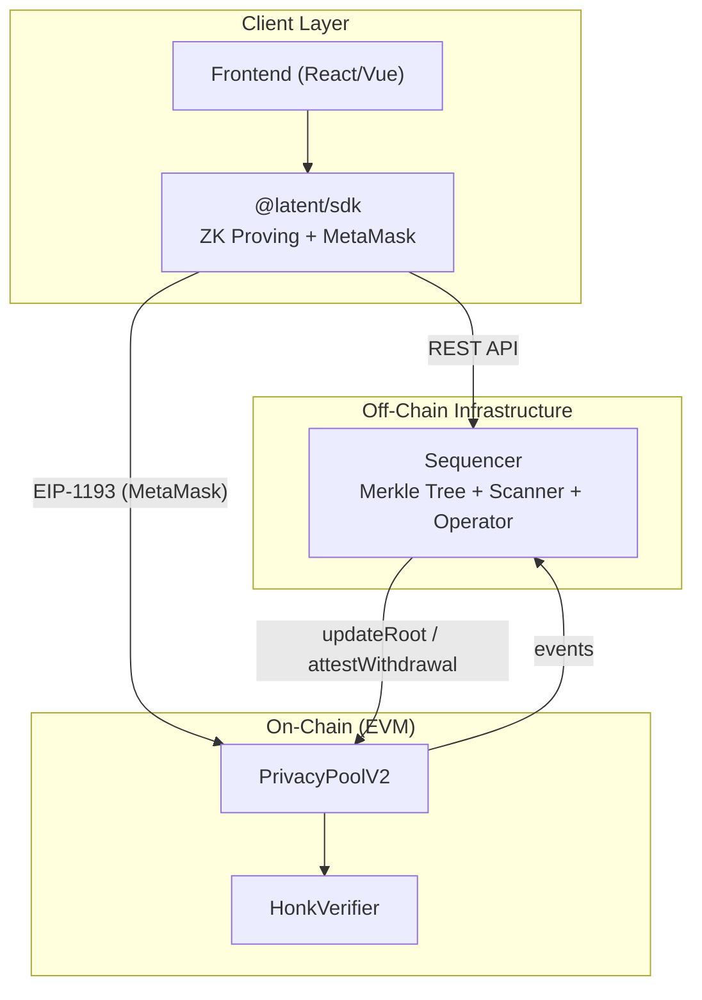

# Latent — Compliant Privacy Stablecoin Payments

> **"Privacy for the public, Transparency for regulators"**

Latent는 **조건부 프라이버시(Conditional Privacy)** 기반 블록체인 결제 시스템의 개념 검증(PoC) 프로젝트입니다. Noir ZK 회로와 Solidity 스마트 컨트랙트로 **외부 관찰자에게는 송수신자 관계를 숨기면서, 운영자에게는 규제 준수를 위한 추적 경로를 제공**합니다.

---

## 핵심 아이디어

| 문제 | Latent 해결 방식 |
|------|--------------|
| 일반 블록체인: 모든 거래가 공개 | ZK Proof + Stealth Address로 송수신자 관계 은닉 |
| Tornado Cash: 완전 익명 → OFAC 제재 | Compliance 암호화 + 2-stage 출금으로 규제 준수 |
| 프론트런 공격 | 수신자가 ZK 증명에 바인딩 (public input) |

---

## Architecture



### Privacy Flow

1. **Deposit**: Alice가 USDT를 예치하면 `commitment`이 커밋먼트 큐에 기록
2. **Merkle Root**: Sequencer가 Poseidon2 Incremental Merkle Tree에 삽입 → root 온체인 제출
3. **ZK Proof**: 오프체인에서 "트리에 유효한 Note가 있다"는 증명 생성 (송신자 은닉)
4. **Stealth Address**: Bob의 일회성 수신 주소 생성 (수신자 은닉)
5. **2-Stage Withdrawal**:
   - Stage 1 (`initiateWithdrawal`): ZK 증명 검증, 자금 보류
   - Stage 2a (`attestWithdrawal`): 운영자 승인 → 자금 즉시 전송
   - Stage 2b (`claimWithdrawal`): 24시간 후 누구나 호출 가능 (검열 저항)
6. **Compliance**: 운영자만 ECIES로 암호화된 송수신자 정보 복호화 가능

### Privacy Guarantee

| 정보 | 외부 관찰자 | 수신자 (Bob) | 운영자 |
|------|:-----------:|:------------:|:------:|
| 거래 금액 | O | O | O |
| 스텔스 주소 | O | O | O |
| **실제 송신자** | **X** | **X** | **O** |
| **실제 수신자** | **X** | O (본인) | **O** |
| **Alice <-> Bob 관계** | **X** | **X** | **O** |

---

## Project Structure

```
latent-mvp/
├── circuits/                        # Noir ZK Circuit (standalone, nargo)
│   ├── Nargo.toml
│   ├── src/main.nr                  # ZK circuit (5 constraints, 22 tests)
│   └── Prover.toml
├── contracts/                       # Solidity (standalone, Foundry)
│   ├── foundry.toml
│   ├── src/
│   │   ├── PrivacyPoolV2.sol        # Core contract
│   │   ├── UltraVerifier.sol        # Auto-generated Honk verifier (DO NOT EDIT)
│   │   └── MockUSDT.sol             # Test ERC20 token
│   ├── test/
│   │   ├── PrivacyPoolV2.t.sol      # 36 unit tests
│   │   └── Verifier.t.sol           # 3 on-chain proof tests
│   └── lib/forge-std/
├── packages/
│   ├── sdk/                         # @latent/sdk — Web SDK (browser)
│   │   ├── src/
│   │   │   ├── client.ts            # LatentClient Facade
│   │   │   ├── core/                # crypto, keys, notes, merkle, types
│   │   │   ├── proving/             # witness, prover (bb.js WASM)
│   │   │   ├── chain/               # wallet (MetaMask), contracts, abi
│   │   │   └── api/                 # sequencer REST client
│   │   └── package.json
│   ├── sequencer/                   # @latent/sequencer — Off-chain service
│   │   ├── src/
│   │   │   ├── index.ts             # CLI entrypoint
│   │   │   ├── crypto.ts            # Poseidon2 + ECIES (Node.js, @aztec/foundation)
│   │   │   ├── tree.ts              # Incremental Merkle Tree
│   │   │   ├── chain.ts             # Chain sync + batch root submission
│   │   │   ├── scanner.ts           # EncryptedNote collection
│   │   │   ├── operator.ts          # Attestation + compliance
│   │   │   ├── api.ts               # HTTP API (11 endpoints, CORS)
│   │   │   ├── store.ts             # JSON persistence
│   │   │   └── types.ts             # Shared types
│   │   ├── __tests__/               # Vitest (56 tests)
│   │   └── package.json
│   └── frontend/                    # @latent/frontend — Web app (planned)
│       └── package.json
├── scripts/                         # Root-level scripts
│   ├── e2e_test.sh                  # Full E2E test (12 scenarios)
│   ├── generate_test_vectors.ts     # Deterministic test vector generator
│   ├── parse_manifest.ts            # E2E manifest parser
│   └── lib/crypto.ts               # Re-export from @latent/sequencer
├── docs/
│   ├── design/                      # Architecture, circuit, contracts, security
│   └── adr/                         # Architecture decision records
├── specs/                           # IDD intent documents
├── package.json                     # Root: npm workspaces ["packages/*"]
└── CLAUDE.md                        # Development guidelines
```

---

## Prerequisites

| Tool | Version | 용도 |
|------|---------|------|
| [nargo](https://noir-lang.org/docs/getting_started/quick_start) | 1.0.0-beta.18 | Noir 회로 컴파일/실행/테스트 |
| [bb (Barretenberg)](https://github.com/AztecProtocol/aztec-packages) | 3.0.0-nightly.20260102 | ZK 증명 생성/검증 |
| [Foundry](https://book.getfoundry.sh/) | 1.5.1+ | Solidity 빌드/테스트 |
| [Node.js](https://nodejs.org/) | 18+ | 스크립트 실행 (tsx) |

> nargo와 bb는 공식 페어링 버전을 사용해야 합니다. 버전 불일치 시 증명 검증이 실패할 수 있습니다.

---

## Quick Start

### 1. Install Dependencies

```bash
npm install
cd contracts && forge install && cd ..
```

### 2. Circuit Tests

```bash
# Noir unit tests (22 tests)
cd circuits && nargo test

# Full E2E (12 scenarios: prove/verify + on-chain)
npm run test:e2e
```

### 3. Contract Tests

```bash
# Foundry unit tests (39 tests: V2 36 + Verifier 3)
npm run test:contracts
```

### 4. Sequencer Tests

```bash
# Vitest unit tests
npm run test:sequencer
```

---

## ZK Circuit Design

### Circuit Inputs

| Input | Type | Visibility | Description |
|-------|------|-----------|-------------|
| `secret` | `Field` | Private | Note 소유권 증명 비밀값 |
| `nullifier_secret_key` | `Field` | Private | 수신자 NSK (출금 권한) |
| `nullifier_pub_key` | `Field` | Private | NPK = poseidon2([nsk, DOMAIN_NPK]) |
| `merkle_siblings` | `[Field; 32]` | Private | Merkle proof 형제 노드 (depth=32) |
| `path_indices` | `[u1; 32]` | Private | Merkle path 방향 (left/right) |
| `note_amount` | `Field` | Private | Note에 기록된 예치 금액 |
| `note_block_number` | `Field` | Private | 예치 블록 번호 |
| `note_depositor` | `Field` | Private | 예치자 주소 (uint160 → Field) |
| `transfer_amount` | `Field` | Private | 전송하려는 금액 |
| `expected_root` | `Field` | **Public** | 검증할 Merkle root |
| `nullifier` | `Field` | **Public** | 이중지불 방지 토큰 |
| `amount` | `Field` | **Public** | 공개 전송 금액 |
| `recipient` | `Field` | **Public** | 수신자 스텔스 주소 |
| `compliance_hash` | `Field` | **Public** | 컴플라이언스 바인딩 해시 |

### 5 Constraint Checks

| # | Constraint | Formula | 실패 시 |
|---|-----------|---------|---------|
| 1 | NPK 바인딩 | `poseidon2([nsk, DOMAIN_NPK]) == npk` | Proof 생성 불가 |
| 2 | Merkle root 일치 | `compute_merkle_root(commitment, siblings, path) == expected_root` | Proof 생성 불가 |
| 3 | Nullifier 정합성 | `poseidon2([secret, nsk, DOMAIN_NULLIFIER]) == nullifier` | Proof 생성 불가 |
| 4 | 금액 유효성 | `transfer_amount > 0 && transfer_amount <= note_amount && amount == transfer_amount` | Proof 생성 불가 |
| 5 | Compliance hash | `poseidon2([depositor, recipient, amount, DOMAIN_COMPLIANCE]) == compliance_hash` | Proof 생성 불가 |

### Hash Functions (Poseidon2 Sponge, t=4)

| 용도 | 수식 | 입력 수 | 도메인 |
|------|------|--------|--------|
| NPK | `poseidon2_hash_2(nsk, DOMAIN_NPK)` | 2 Fields | 5 |
| Commitment | `poseidon2_hash_6(secret, npk, amount, block, depositor, DOMAIN_COMMITMENT)` | 6 Fields | 1 |
| Nullifier | `poseidon2_hash_3(secret, nsk, DOMAIN_NULLIFIER)` | 3 Fields | 2 |
| Compliance Hash | `poseidon2_hash_4(depositor, recipient, amount, DOMAIN_COMPLIANCE)` | 4 Fields | 4 |
| Merkle node | `poseidon2_hash_3(left, right, DOMAIN_MERKLE)` | 3 Fields | 3 |

---

## Test Coverage

| Category | Count | Result |
|----------|-------|--------|
| Circuit unit tests (nargo) | 22 | ALL PASS |
| Contract unit tests — V2 (Foundry) | 36 | ALL PASS |
| Contract — Verifier (Foundry) | 3 | ALL PASS |
| E2E circuit scenarios | 12 (5 happy + 7 fail) | ALL PASS |
| Sequencer unit tests (vitest) | 31 | ALL PASS |

---

## MVP 제약사항

| 항목 | 상태 | 비고 |
|------|:----:|------|
| 단일 토큰 (USDT) | O | MockUSDT로 테스트 |
| 가변 금액 전송 | O | 부분 전송 지원 |
| Sender Privacy (Privacy Pool) | O | Merkle inclusion ZK proof |
| Receiver Privacy (Stealth Address) | O | ECDH, EIP-5564 방식 |
| Compliance (ECIES 암호화) | O | 오프체인 XOR 기반 |
| 2-Stage Withdrawal | O | Operator attestation + 24h timeout |
| Recipient Binding | O | ZK proof public input |
| Compliance Hash Binding | O | ZK proof public input |

### 알려진 제한사항

| 제한 | 설명 | 영향도 |
|------|------|--------|
| XOR 기반 암호화 | ECIES에서 AES-GCM 대신 XOR 사용 | 프로덕션에서는 AES-GCM 전환 필요 |
| HonkVerifier 코드 크기 | Optimizer로 23.2 KB (EIP-170 한계 근접) | 추가 최적화 여지 제한 |
| bb VK 비결정성 | `bb write_vk` 단독 사용 시 VK 불일치 | `bb prove --write_vk`로 우회 필수 |
| 단일 Operator | `operator` 주소 1개 고정 | 멀티시그 or DAO 거버넌스로 확장 필요 |
| 가스 비용 | On-chain ZK 검증 ~2.9M gas | L2 배포 또는 proof aggregation 검토 |

---

## References

- [Noir Documentation](https://noir-lang.org/docs/)
- [Barretenberg (bb)](https://github.com/AztecProtocol/aztec-packages)
- [EIP-5564: Stealth Addresses](https://eips.ethereum.org/EIPS/eip-5564)
- [Privacy Pools Paper](https://papers.ssrn.com/sol3/papers.cfm?abstract_id=4563364)

---

## License

ISC
