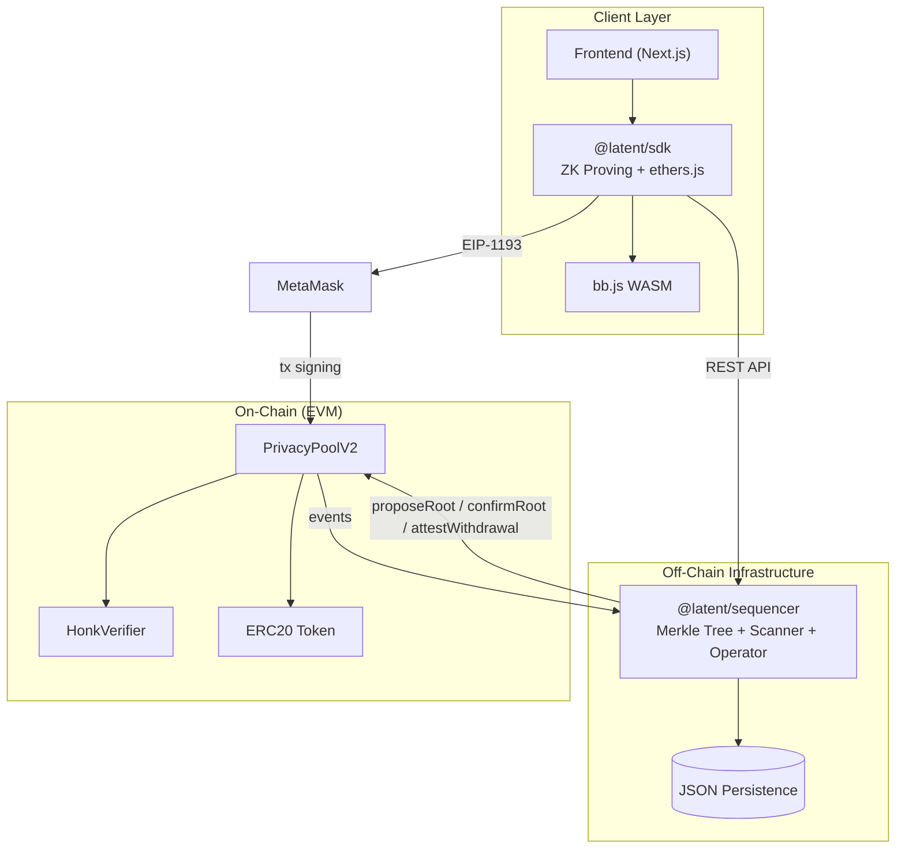
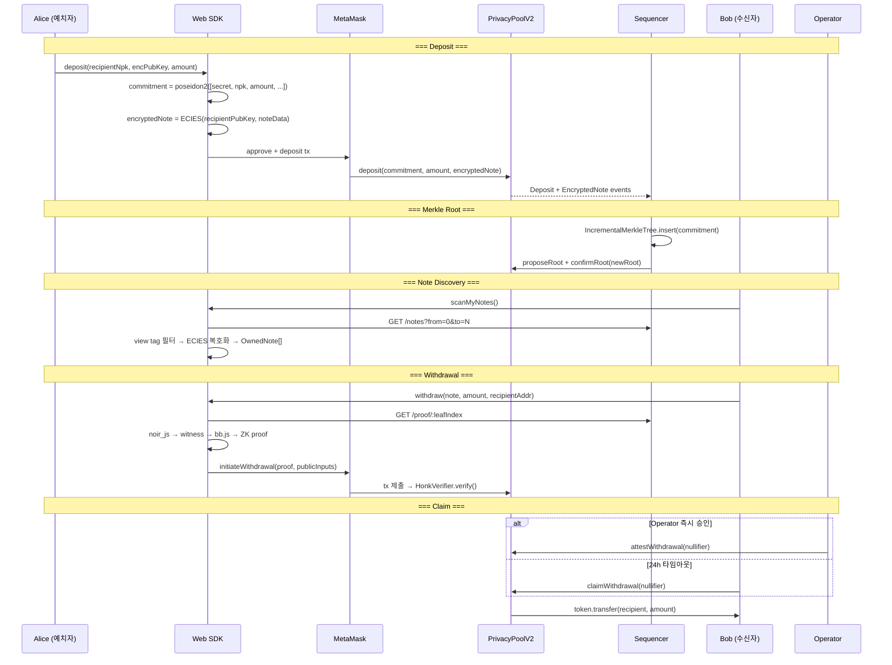
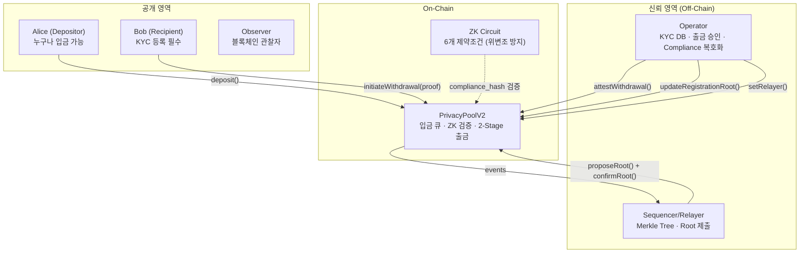
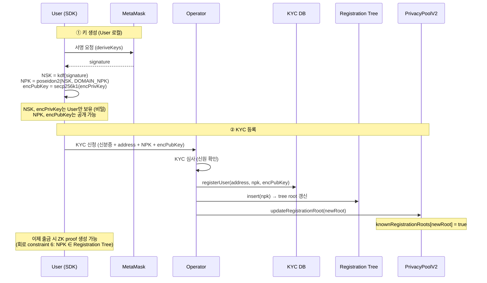
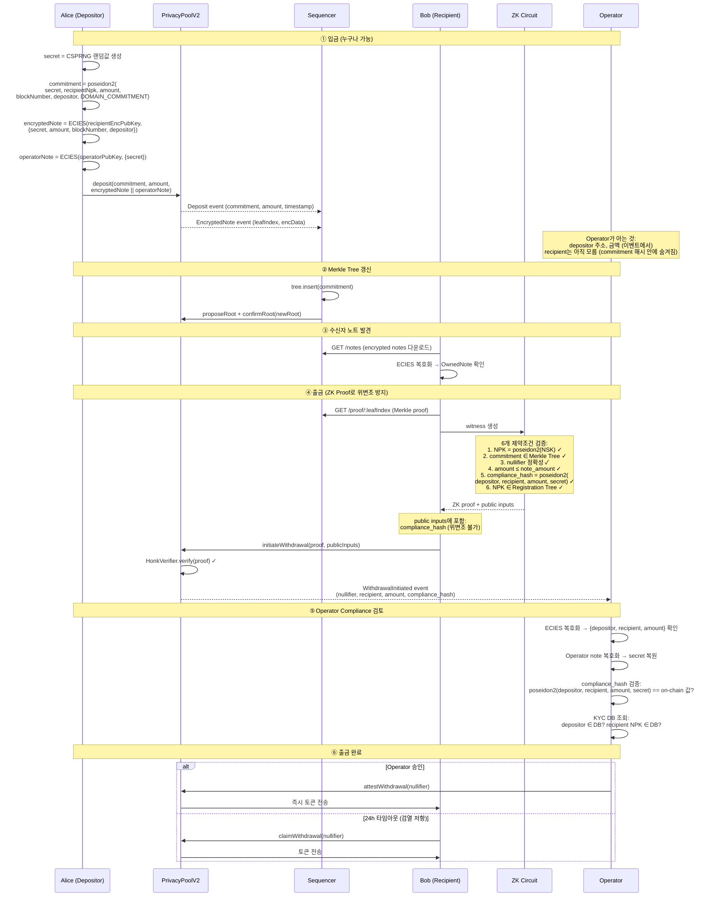
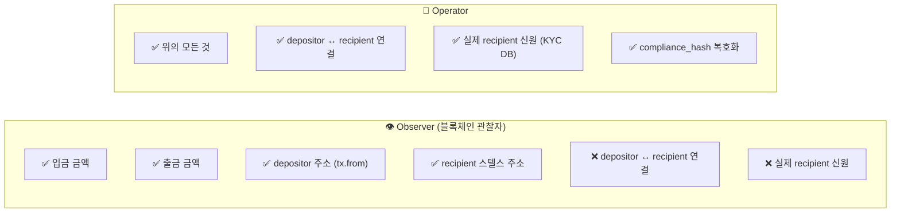

# System Architecture

> Privacy for the public, Transparency for regulators

## 1. Overview

### 문제와 해답

| 기존 블록체인 | 기존 프라이버시 (Tornado Cash) | Latent |
|---|---|---|
| 모든 거래가 공개 | 완전 익명 → OFAC 제재 | 조건부 프라이버시 |

**4계층 메커니즘**:

| 계층 | 기술 | 보호 대상 |
|------|------|-----------|
| Privacy Pool | Poseidon2 Merkle + ZK Proof | 송신자 익명화 |
| 2-Stage Withdrawal | 운영자 승인 + 24h timeout | 규제 통제 + 검열 저항 |
| Stealth Address | ECIES (secp256k1 ECDH) | 수신자 익명화 |
| Compliance Hash | 인서킷 해시 바인딩 + ECIES | 규제 준수 데이터 |

### 접근 권한

| 정보 | 관찰자 | 수신자 | 운영자 |
|------|--------|--------|--------|
| 전송 금액 / 스텔스 주소 | O | O | O |
| **실제 송신자** | **X** | **X** | **O** |
| **실제 수신자** | **X** | O (본인) | **O** |
| **거래 연결 (Alice↔Bob)** | **X** | **X** | **O** |

---

## 2. System Diagram



### 컴포넌트

| 컴포넌트 | 위치 | 역할 | 문서 |
|----------|------|------|------|
| ZK Circuit | `circuits/` | 6개 제약조건 검증 (Poseidon2) | [circuit.md](./circuit.md) |
| Smart Contracts | `contracts/` | 온체인 검증, dual-approval root, 2-stage withdrawal | [contracts.md](./contracts.md) |
| Sequencer | `packages/sequencer/` | Incremental Merkle, scanner, operator, registration tree | [sequencer.md](./sequencer.md) |
| Crypto Library | `packages/sequencer/src/crypto.ts` | Poseidon2, ECIES, Merkle (Node.js) | [circuit.md](./circuit.md#crypto-library) |
| Web SDK | `packages/sdk/` | 브라우저 ZK proving, ethers.js | [sdk.md](./sdk.md) |
| Frontend | `packages/frontend/` | Next.js 앱 (React 19, Tailwind v4) | — |

---

## 3. Data Flow



---

## 4. Compliance Flow

> Operator는 위변조 불가능한 값으로 송금자·수신자·금액을 추적한다.

### 4.1 Actors



### 4.2 KYC 등록 흐름



### 4.3 Compliance 추적 흐름



### 4.4 위변조 방지 메커니즘

| 공격 시나리오 | 방어 메커니즘 |
|-------------|-------------|
| Bob이 가짜 depositor를 compliance_hash에 넣음 | ZK circuit이 commitment의 원래 depositor로 해시 계산 → proof 실패 |
| Bob이 가짜 recipient를 넣음 | ZK circuit이 public input의 recipient로 해시 계산 → on-chain 값과 불일치 |
| Bob이 금액을 조작 | ZK circuit이 실제 transfer_amount로 해시 계산 → proof 실패 |
| 미등록 사용자가 출금 시도 | ZK circuit constraint 6: NPK가 Registration Tree에 없으면 proof 생성 불가 |
| Observer가 compliance_hash를 brute-force 역산 | secret salt 추가 → Observer는 secret을 모르므로 역산 불가 |
| 서명 위조 시도 | ECDSA 복원 → operator 주소 불일치 시 revert |

### 4.5 정보 가시성 매트릭스



---

## 5. Project Structure

```
latent-mvp/                          # pnpm/npm workspaces monorepo
├── circuits/                        # ZK Circuit (Noir)
│   ├── src/main.nr                  # 6 constraints, 31 tests, Poseidon2
│   └── Prover.toml                  # 샘플 입력
│
├── contracts/                       # Smart Contracts (Foundry)
│   ├── src/
│   │   ├── PrivacyPoolV2.sol        # 핵심 컨트랙트 (dual-approval root)
│   │   ├── UltraVerifier.sol        # 자동생성 (수정 금지)
│   │   └── MockUSDT.sol             # 테스트용 ERC20
│   └── test/                        # 73 Foundry tests
│
├── packages/
│   ├── sdk/                         # @latent/sdk (브라우저)
│   │   ├── src/                     # client, core, proving, chain, api
│   │   └── __tests__/               # 76 Vitest tests
│   │
│   ├── sequencer/                   # @latent/sequencer (Node.js)
│   │   ├── src/                     # tree, chain, scanner, operator, api, crypto
│   │   └── __tests__/               # 71 Vitest tests
│   │
│   └── frontend/                    # @latent/frontend (Next.js 15 + React 19)
│       └── src/                     # App Router, Tailwind v4
│
├── scripts/                         # 유틸리티 스크립트
│   ├── lib/crypto.ts                # 공유 Poseidon2 + ECIES (E2E/벡터 생성용)
│   ├── generate_test_vectors.ts     # E2E 시나리오 생성
│   ├── e2e_test.sh                  # 전체 E2E 테스트
│   └── dev.sh                       # 개발 서버 실행
│
├── specs/                           # IDD 의도 문서
└── docs/                            # 설계 문서
```

---

## 6. Tests

| 레이어 | 도구 | 테스트 수 | 명령어 |
|--------|------|----------|--------|
| Circuit | `nargo test` | 31 | `cd circuits && nargo test` |
| Contracts | `forge test` | 73 | `cd contracts && forge test -vv` |
| SDK | `vitest` | 76 | `npm run test:sdk` |
| Sequencer | `vitest` | 71 | `npm run test:sequencer` |
| E2E | `e2e_test.sh` | — | `npm run test:e2e` |

---

## 7. Tool Versions

| 도구 | 버전 | 비고 |
|------|------|------|
| nargo | 1.0.0-beta.18 | Noir 컴파일러 |
| bb | 3.0.0-nightly.20260102 | Barretenberg 증명 백엔드 |
| Foundry | latest | Solidity 테스트 |
| @aztec/bb.js | 3.0.0-nightly.20260102 | 브라우저 WASM proving |
| @noir-lang/noir_js | 1.0.0-beta.18 | 브라우저 witness 생성 |

**주요 제약**: nargo↔bb, @noir-lang/noir_js↔nargo, @aztec/bb.js↔bb 버전이 반드시 일치해야 함.
