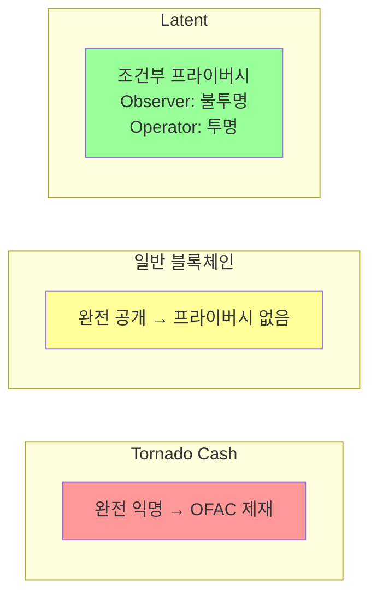
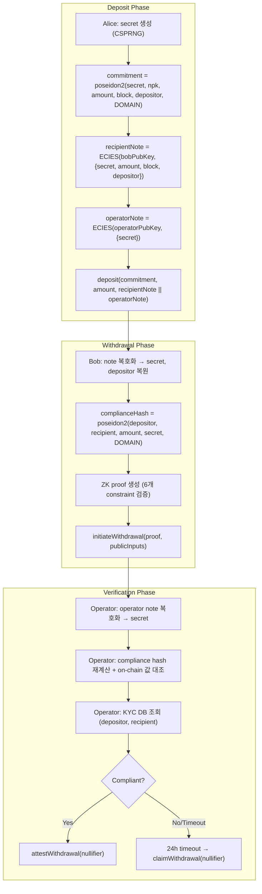
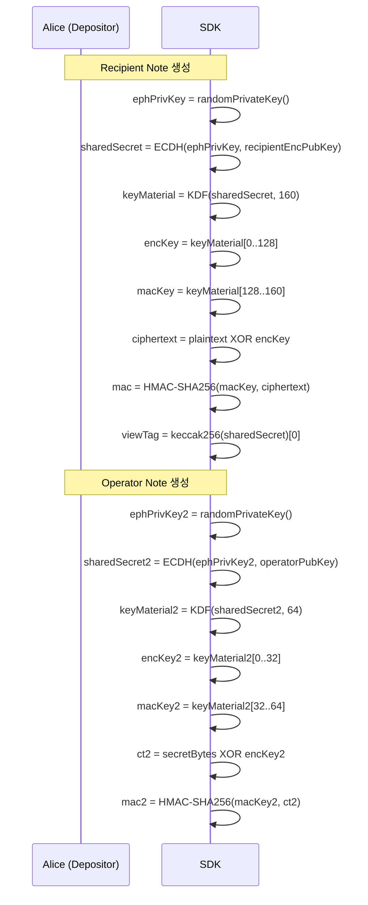
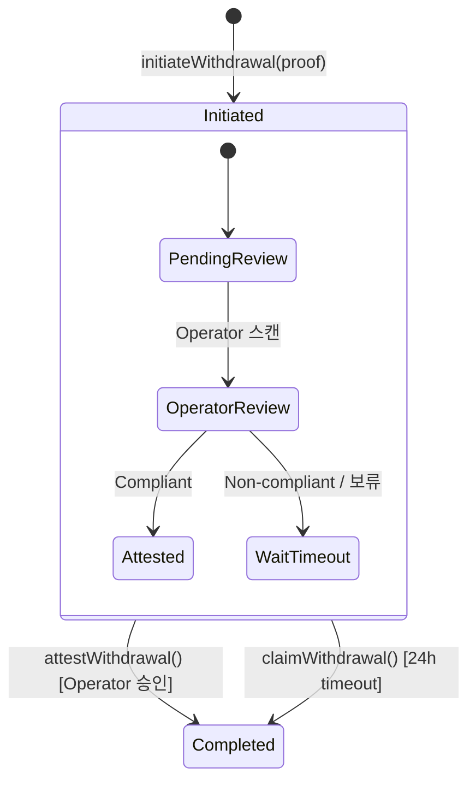
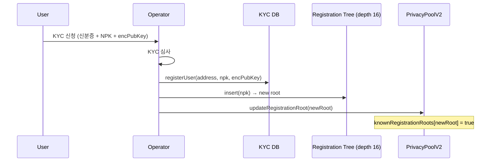
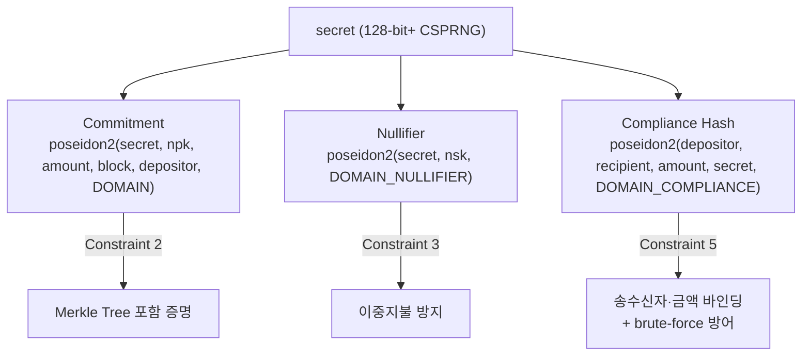
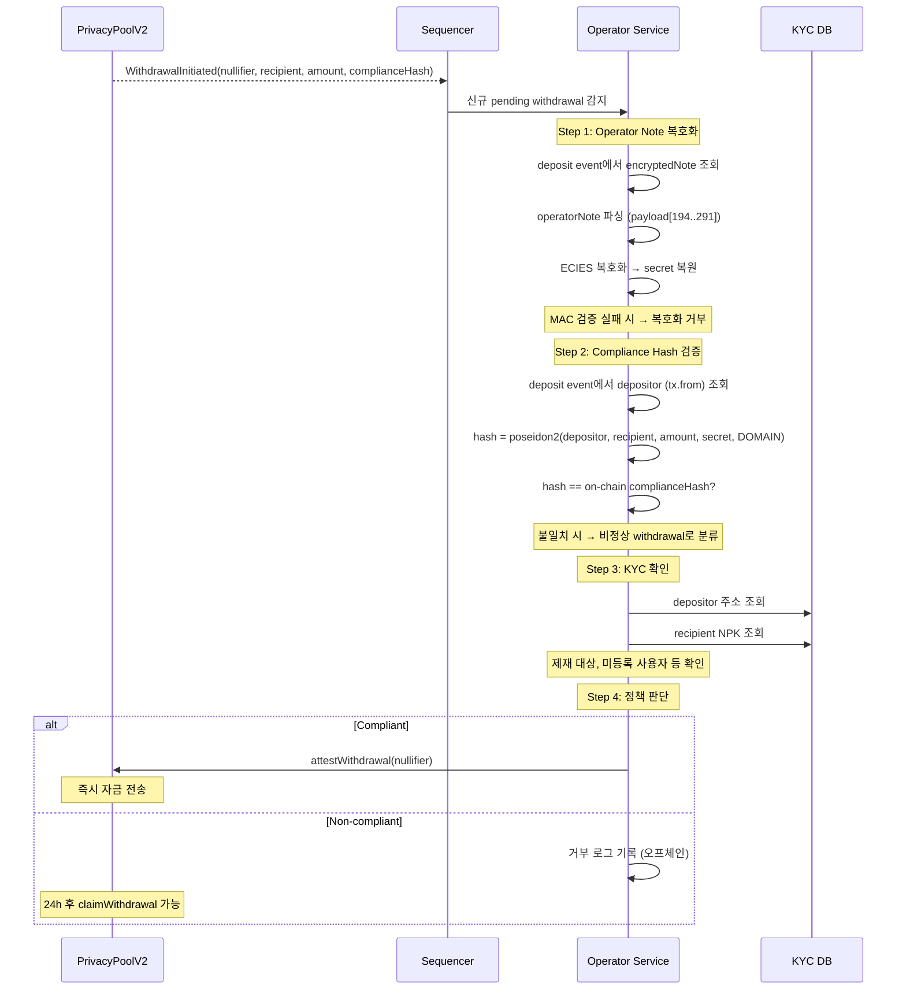

# Compliance Design

> Privacy for the public, Transparency for regulators

## 1. 개요

Latent의 compliance 시스템은 세 가지 상충하는 요구사항을 동시에 만족한다:

| 요구사항 | 보호 대상 | 메커니즘 |
|----------|----------|----------|
| **프라이버시** | 일반 관찰자에게 송수신자 연결 차단 | ZK proof + stealth address |
| **규제 준수** | 운영자에게 송수신자·금액 추적 보장 | Compliance hash + ECIES 암호화 |
| **검열 저항** | 운영자 거부/장애 시 자금 인출 보장 | 24h timeout fallback |

기존 접근법과의 비교:



---

## 2. 요구사항

### 2.1 기능 요구사항 (Functional)

| ID | 요구사항 | 검증 레이어 |
|----|----------|------------|
| FR-1 | 출금 시 depositor, recipient, amount, secret이 위변조 불가능하게 바인딩되어야 한다 | ZK Circuit (constraint 5) |
| FR-2 | Operator만 depositor↔recipient 연결을 복호화할 수 있어야 한다 | ECIES 암호화 (secp256k1) |
| FR-3 | Observer는 depositor↔recipient 연결을 추론할 수 없어야 한다 | Secret salt (ADR-003) |
| FR-4 | KYC 등록된 사용자만 출금할 수 있어야 한다 | ZK Circuit (constraint 6) + Registration Tree |
| FR-5 | Operator가 compliance 검증 후 즉시 출금을 승인할 수 있어야 한다 | `attestWithdrawal()` |
| FR-6 | Operator 거부/장애 시 24시간 후 출금이 가능해야 한다 | `claimWithdrawal()` + timeout |
| FR-7 | Deposit 시 recipient note와 operator note가 함께 on-chain에 기록되어야 한다 | `EncryptedNote` event (291B payload) |

### 2.2 비기능 요구사항 (Non-Functional)

| ID | 요구사항 | 기준 |
|----|----------|------|
| NF-1 | Compliance hash는 128-bit 이상의 preimage resistance를 가져야 한다 | Poseidon2 BN254 (t=4) |
| NF-2 | ECIES 암호화는 ciphertext 변조를 탐지해야 한다 | HMAC-SHA256 인증 (ADR-004) |
| NF-3 | Secret은 128-bit+ CSPRNG으로 생성되어야 한다 | `crypto.getRandomValues()` |
| NF-4 | MAC 검증은 timing attack에 안전해야 한다 | Constant-time comparison |
| NF-5 | Operator note 복호화 실패가 자금 동결로 이어지면 안 된다 | 24h timeout fallback |

### 2.3 신뢰 가정 (Trust Assumptions)

| 주체 | 신뢰 수준 | 근거 |
|------|----------|------|
| ZK Circuit | Trustless | 수학적 보장 (soundness) |
| Smart Contract | Trustless | EVM 실행 보장 |
| Operator | Semi-trusted | Compliance 복호화 가능하나 자금 탈취 불가 (nsk 미보유) |
| Relayer | Semi-trusted | Root 제안만 가능, 확정은 operator 승인 필요 (ADR-001) |
| Observer | Untrusted | 모든 on-chain 데이터 접근 가능, 프라이버시 보호 대상 |

---

## 3. 설계

### 3.1 전체 Compliance 아키텍처



### 3.2 Compliance Hash Binding (In-Circuit)

ZK circuit의 constraint 5가 compliance hash의 무결성을 보장한다.

**수식**:
```
compliance_hash = poseidon2(depositor, recipient, amount, secret, DOMAIN_COMPLIANCE)
```

**Circuit에서의 검증** (`circuits/src/main.nr`):
```noir
fn compute_compliance_hash(depositor: Field, recipient: Field, amount: Field, secret: Field) -> Field {
    poseidon2_hash_5(depositor, recipient, amount, secret, DOMAIN_COMPLIANCE)
}

// Constraint 5: compliance hash 검증
assert(computed_compliance_hash == compliance_hash, "Compliance hash mismatch");
```

**위변조 방지**:

| 공격 시나리오 | 방어 메커니즘 |
|-------------|-------------|
| Bob이 가짜 depositor 삽입 | Circuit이 commitment 내 원본 depositor로 해시 계산 → mismatch |
| Bob이 가짜 recipient 삽입 | Circuit이 public input recipient로 계산 → on-chain 값과 불일치 |
| Bob이 금액 조작 | Circuit이 실제 transfer_amount로 계산 → proof 실패 |
| Observer brute-force 역산 | Secret salt → 128-bit+ 엔트로피 → brute-force 불가 (ADR-003) |

**입력별 출처와 신뢰성**:

| 입력 | 출처 | 검증 방법 |
|------|------|----------|
| `depositor` | `note_depositor` (commitment에 포함) | Constraint 2 (Merkle proof) |
| `recipient` | Public input (on-chain withdrawal tx) | Constraint 4.5 (160-bit range check) |
| `amount` | `transfer_amount` (private input) | Constraint 4 (`0 < amount <= note_amount`) |
| `secret` | Note의 원본 secret | Constraint 3 (nullifier 계산에도 사용) |
| `DOMAIN_COMPLIANCE` | 상수 4 | 하드코딩 |

### 3.3 ECIES Note 암호화

Deposit 시 두 종류의 암호화된 note가 on-chain에 기록된다.

#### Recipient Note (194B)

수신자(Bob)가 자신의 note를 발견하고 출금에 필요한 정보를 복구하기 위한 암호문.

```
Format: [ephemeralPubKey(33B) | ciphertext(128B) | mac(32B) | viewTag(1B)]
Plaintext: secret(32B) + amount(32B) + blockNumber(32B) + depositor(32B) = 128B
Encryption: ECIES(recipientEncPubKey, plaintext)
```

#### Operator Note (97B)

Operator가 compliance hash를 재계산하기 위해 secret을 복구하는 암호문.

```
Format: [ephemeralPubKey(33B) | ciphertext(32B) | mac(32B)]
Plaintext: secret(32B)
Encryption: ECIES(operatorPubKey, secret)
```

#### Combined On-Chain Payload (291B)

```
[recipientNote(194B) | operatorNote(97B)] = 291 bytes
```

Solidity `bytes calldata encryptedNote`가 가변 길이를 허용하므로 컨트랙트 변경 없이 확장 가능.

#### ECIES 암호화 흐름



### 3.4 2-Stage Withdrawal

출금은 두 단계로 나뉘어 compliance 검증과 검열 저항을 동시에 보장한다.



#### Stage 1: `initiateWithdrawal(proof, publicInputs)`

```solidity
// Public inputs 추출
bytes32 complianceHash = publicInputs[4];

// ZK proof 검증 (compliance hash 포함 6개 constraint)
verifier.verify(proof, publicInputs);

// 보류 출금 등록
pendingWithdrawals[nullifier] = PendingWithdrawal({
    recipient: recipient,
    amount: amount,
    complianceHash: complianceHash,
    deadline: block.timestamp + ATTESTATION_WINDOW, // 24h
    completed: false
});
```

- ZK proof가 compliance hash의 무결성을 보장
- Compliance hash는 on-chain에 저장되어 operator가 독립적으로 검증 가능

#### Stage 2a: `attestWithdrawal(nullifier)` — Operator 즉시 승인

```solidity
require(msg.sender == operator, "Only operator");
pw.completed = true;
token.transfer(pw.recipient, pw.amount);
```

Operator가 compliance 검증 완료 후 즉시 자금 방출.

#### Stage 2b: `claimWithdrawal(nullifier)` — 24h Timeout

```solidity
require(block.timestamp >= pw.deadline, "Window active");
pw.completed = true;
token.transfer(pw.recipient, pw.amount);
```

Operator 응답이 없으면 누구나 24시간 후 자금 방출 가능 (검열 저항).

#### Timeout 설계 근거

| 고려사항 | 설명 |
|----------|------|
| **24h 선택 이유** | Operator에게 충분한 검토 시간 제공 + 사용자에게 합리적 대기 시간 |
| **검열 저항** | Operator가 악의적으로 거부하거나 장애가 발생해도 자금이 영구 동결되지 않음 |
| **규제 trade-off** | Non-compliant 출금도 24h 후 실행 가능 → 오프체인 법적 조치로 보완 |
| **호출자 제한 없음** | `claimWithdrawal`은 누구나 호출 가능 (recipient 본인이 아니어도) |

### 3.5 KYC Registration (Access Control)

Registration Tree가 KYC 통과 사용자만 출금할 수 있도록 ZK 레벨에서 강제한다 (ADR-002).



**회로 제약조건 6**:
```
merkle_root(npk, registration_siblings, registration_path) == expected_registration_root
```

- Registration leaf = NPK 직접 사용 (추가 해시 불필요)
- NPK = `poseidon2(NSK, DOMAIN_NPK)` — constraint 1에서 이미 검증
- 따라서 "NSK를 아는 KYC 등록 사용자만 출금 가능"이 회로 레벨에서 보장

---

## 4. 정보 가시성

### 4.1 주체별 접근 권한

| 정보 | Observer | Depositor (Alice) | Recipient (Bob) | Operator |
|------|:--------:|:-----------------:|:----------------:|:--------:|
| deposit 금액 | O | O | O | O |
| withdrawal 금액 | O | O | O | O |
| depositor 주소 (tx.from) | O | O | X | O |
| recipient stealth 주소 | O | X | O | O |
| secret | X | O (생성자) | O (note 복호화) | O (operator note) |
| depositor ↔ recipient 연결 | **X** | X | X | **O** |
| compliance hash preimage | X | X | O | O |
| NSK (nullifier secret key) | X | X | O (본인) | X |

### 4.2 Operator가 아는 것 vs 할 수 있는 것

| 단계 | Operator가 아는 것 | Operator가 할 수 없는 것 |
|------|-------------------|------------------------|
| Deposit 시 | depositor 주소, 금액, encrypted notes | recipient 식별 (commitment 해시 안에 숨겨짐) |
| Withdrawal 시 | depositor, recipient, amount, secret (복호화) | 자금 탈취 (NSK 미보유 → nullifier 생성 불가) |
| Attestation | compliance 승인/거부 결정 | 24h 후 자금 영구 차단 |

### 4.3 Secret의 역할

`secret`은 시스템 전반에서 다중 목적으로 사용된다:



---

## 5. Operator 검증 절차

### 5.1 전체 흐름



### 5.2 Operator Note 복호화 상세

```
Input:
  - operatorNote (97B): ephPubKey(33B) + ciphertext(32B) + mac(32B)
  - operatorPrivKey: Operator의 secp256k1 개인키

Process:
  1. sharedSecret = ECDH(operatorPrivKey, ephPubKey)
  2. keyMaterial = KDF(sharedSecret, 64)  // 32B enc + 32B mac
  3. macKey = keyMaterial[32..64]
  4. expectedMac = HMAC-SHA256(macKey, ciphertext)
  5. constantTimeEqual(expectedMac, mac) → 실패 시 reject
  6. encKey = keyMaterial[0..32]
  7. secret = ciphertext XOR encKey

Output:
  - secret (bigint) — compliance hash 재계산에 사용
```

### 5.3 Compliance Hash 재계산

```typescript
// Operator가 독립적으로 계산
const depositor = getDepositorFromEvent(depositTxHash);  // on-chain
const { recipient, amount, complianceHash } = withdrawalEvent;  // on-chain
const secret = decryptOperatorNote(operatorPrivKey, note);

const computed = poseidon2Hash5(
    depositor, recipient, amount, secret, DOMAIN_COMPLIANCE
);

assert(computed === complianceHash);  // on-chain 값과 대조
```

### 5.4 실패 시나리오

| 실패 유형 | 원인 | 결과 |
|----------|------|------|
| Operator note 복호화 실패 | Operator 키 불일치, 손상된 payload | Secret 복원 불가 → compliance 검증 불가 → 24h timeout |
| MAC 검증 실패 | 전송 중 변조, 잘못된 암호화 | `ECIES: MAC verification failed` → 복호화 거부 |
| Compliance hash 불일치 | 비정상적 proof (이론적으로 불가능) | 검증 실패 → 승인 보류 |
| KYC 미등록 | 미등록 depositor 또는 recipient | 정책에 따라 거부 또는 보류 |
| Operator 장애 | 서버 다운, 네트워크 문제 | 자동 24h timeout → 사용자 직접 claim |

---

## 6. 보안 분석

### 6.1 Compliance 관련 위협 모델

| 위협 | 공격자 | 방어 |
|------|--------|------|
| Depositor↔recipient 연결 추론 | Observer | Secret salt (ADR-003) → brute-force 불가 |
| Compliance hash 위조 | Recipient | ZK circuit constraint 5 → hash 입력 변경 불가 |
| KYC 미등록 사용자 출금 | 미등록 사용자 | ZK circuit constraint 6 → Registration Tree 증명 필수 |
| Operator note 변조 | 공격자 | HMAC-SHA256 인증 (ADR-004) → 변조 탐지 |
| Operator가 자금 탈취 | Malicious operator | NSK 미보유 → nullifier 생성 불가 → proof 불가 |
| Operator 검열 (출금 거부) | Malicious operator | 24h timeout → `claimWithdrawal()` |
| Recipient 주소 절삭 공격 | Recipient | 160-bit range check (`to_be_bytes::<20>`) |

### 6.2 주체별 보안 매트릭스

| 주체 | secret 접근 | NSK 접근 | 자금 탈취 | 연결 추론 |
|------|:----------:|:--------:|:--------:|:--------:|
| Depositor (Alice) | O (생성자) | X | X | X |
| Recipient (Bob) | O (note 복호화) | O (본인) | O (정당) | X |
| Operator | O (operator note) | **X** | **X** | O (compliance용) |
| Observer | **X** | X | X | **X** |

### 6.3 24h Timeout의 보안 함의

Timeout은 검열 저항을 위한 핵심 메커니즘이지만 trade-off가 존재한다:

```
                  Compliance ←――――――――→ Censorship Resistance
                       ↑                        ↑
               Operator 승인              24h Timeout
            (즉시, 규제 통제)         (자동, 검열 방지)
```

**비정상 출금 시나리오**: Operator가 non-compliant로 판단하여 attestation을 거부하더라도, 24h 후 사용자가 직접 `claimWithdrawal`을 호출하면 자금이 방출된다. 이는 의도된 설계이며, 다음과 같은 이유로 수용된다:

1. **ZK proof는 이미 검증됨**: on-chain verifier가 proof의 유효성을 확인. 자금 소유권은 수학적으로 보장
2. **Compliance hash는 on-chain 기록**: 사후 감사 가능 (법적 증거)
3. **KYC 등록 필수**: Registration Tree constraint로 미등록 사용자는 proof 자체를 생성 불가
4. **오프체인 법적 조치**: Non-compliant 출금에 대해 KYC 정보 기반 법적 대응 가능

---

## 7. 구현 매핑

| 컴포넌트 | 파일 | 핵심 로직 |
|----------|------|----------|
| Compliance hash (circuit) | `circuits/src/main.nr` | `compute_compliance_hash()`, constraint 5 |
| Compliance hash (Node.js) | `packages/sequencer/src/crypto.ts` | `computeComplianceHash()` |
| Compliance hash (browser) | `packages/sdk/src/core/crypto.ts` | `computeComplianceHash()` |
| ECIES recipient note | `packages/sequencer/src/crypto.ts`, `packages/sdk/src/core/crypto.ts` | `encryptNote()`, `decryptNote()` |
| ECIES operator note | 동일 | `encryptOperatorNote()`, `decryptOperatorNote()` |
| Note parsing | `packages/sdk/src/core/notes.ts` | `parseEncryptedNote()`, `tryDecryptNote()` |
| On-chain payload | `packages/sdk/src/chain/contracts.ts` | 291B serialization/deserialization |
| 2-stage withdrawal | `contracts/src/PrivacyPoolV2.sol` | `initiateWithdrawal()`, `attestWithdrawal()`, `claimWithdrawal()` |
| Operator service | `packages/sequencer/src/operator.ts` | `decryptOperatorSecret()`, `decryptCompliance()`, `attest()` |
| Registration tree | `contracts/src/PrivacyPoolV2.sol` | `updateRegistrationRoot()`, `knownRegistrationRoots` |
| KYC registration | `packages/sequencer/src/api.ts` | `POST /operator/register` |

---

## 8. 관련 결정 기록

| ADR | 결정 | Compliance 관련성 |
|-----|------|------------------|
| [ADR-001](../adr/001-merkle-root-integrity.md) | Dual-approval root | Merkle root 위조 방지 → compliance hash가 유효한 commitment에 바인딩됨을 보장 |
| [ADR-002](../adr/002-registration-tree.md) | Registration Tree | KYC 등록 강제 → 미등록 사용자 출금 차단 |
| [ADR-003](../adr/003-compliance-hash-salt.md) | Compliance hash salt | Secret salt → Observer brute-force 방어 |
| [ADR-004](../adr/004-ecies-hmac-authentication.md) | ECIES HMAC-SHA256 | Note 변조 방지 → Operator note 무결성 보장 |
