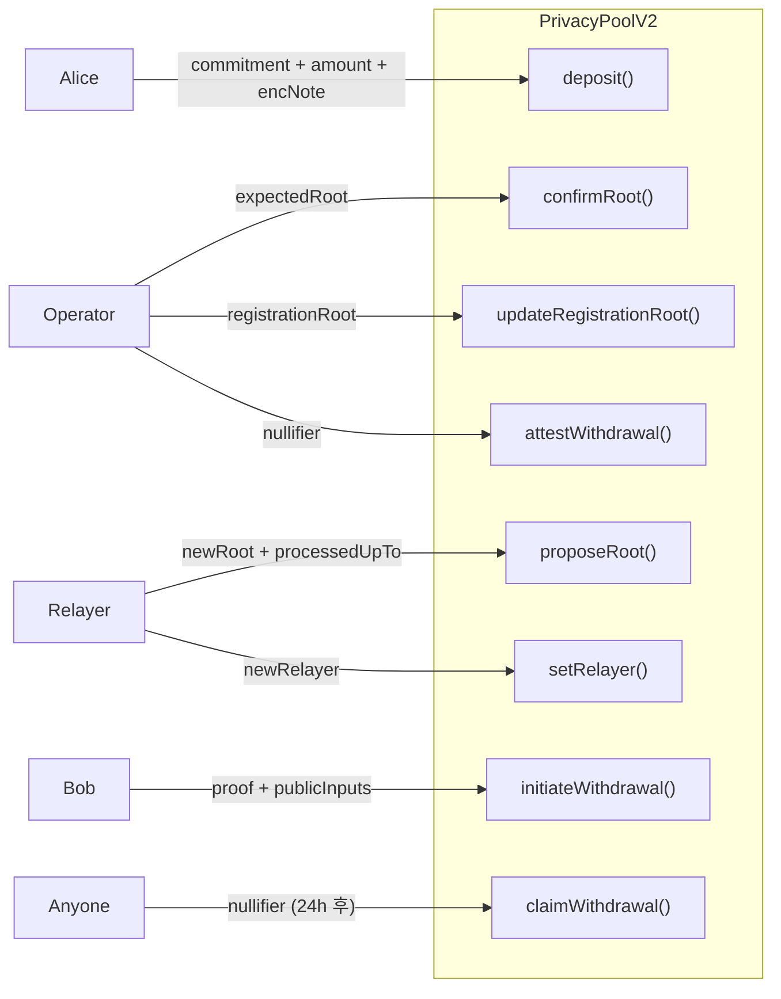

# Smart Contracts

> `contracts/src/PrivacyPoolV2.sol` — 오프체인 Poseidon2 Merkle, 2-stage withdrawal

## Architecture



## Role Separation

| 역할 | 함수 | 설명 |
|------|------|------|
| **사용자** | `deposit()` | 토큰 예치 + commitment 큐 저장 |
| **Relayer** | `proposeRoot()` | 오프체인 Poseidon2 root 제안 (Dual-approval Stage 1) |
| **Operator** | `confirmRoot()` | 독립 계산 후 root 확정 (Dual-approval Stage 2) |
| **Relayer/Operator** | `cancelProposedRoot()` | 제안된 root 취소 |
| **Operator** | `updateRegistrationRoot()` | KYC Registration Tree root 갱신 |
| **사용자** | `initiateWithdrawal()` | ZK 증명 검증 → 자금 보류 (Stage 1) |
| **Operator** | `attestWithdrawal()` | 즉시 승인 → 자금 전송 (Stage 2a) |
| **누구나** | `claimWithdrawal()` | 24h 타임아웃 → 자금 전송 (Stage 2b, 검열 저항) |
| **Relayer** | `setRelayer()` | Relayer 주소 이전 (EOA → multisig 마이그레이션 등) |

## On-chain State

| 상태 | 설명 |
|------|------|
| `commitments[index]` | commitment 큐 |
| `knownRoots[root]` | 확정된 Merkle root 목록 |
| `currentRoot` | 최신 확정 root |
| `pendingRoot` | 제안 대기 중인 root (`PendingRoot` struct: root, processedUpTo, proposed) |
| `nullifiers[nullifier]` | 사용된 nullifier (이중지불 방지) |
| `knownRegistrationRoots[root]` | 승인된 Registration Tree root 목록 |
| `currentRegistrationRoot` | 최신 Registration Tree root |
| `pendingWithdrawals[nullifier]` | 보류 출금 (recipient, amount, complianceHash, deadline, completed) |

## Events

`Deposit`, `EncryptedNote`, `RootProposed`, `RootConfirmed`, `WithdrawalInitiated`, `WithdrawalAttested`, `WithdrawalClaimed`, `RelayerUpdated`, `RegistrationRootUpdated`

## UltraVerifier

`latent_circuit` (공개 입력 6개: `expected_root`, `nullifier`, `amount`, `recipient`, `compliance_hash`, `expected_registration_root`) 기준으로 생성. **수동 편집 금지**.

```bash
# 재생성 절차 (회로 변경 시)
cd circuits
nargo compile && nargo execute
bb prove -b target/latent_circuit.json -w target/latent_circuit.gz \
  -o target/proof --write_vk -t evm
bb write_solidity_verifier -k target/proof/vk -o ../contracts/src/UltraVerifier.sol
```

검증: `NUMBER_OF_PUBLIC_INPUTS = 22` (= 6개 공개 입력 × 3 limbs + 4 UltraHonk 내부 메타데이터).
`target/proof/public_inputs` 크기가 192 bytes (6 × 32)인지 확인.

## Tests

| 파일 | 테스트 수 | 대상 |
|------|----------|------|
| `PrivacyPoolV2.t.sol` | 70 | V2 전체 기능 (dual-approval, registration, 2-stage withdrawal) |
| `Verifier.t.sol` | 3 | 온체인 proof 검증 |

```bash
cd contracts && forge test -vv
```
