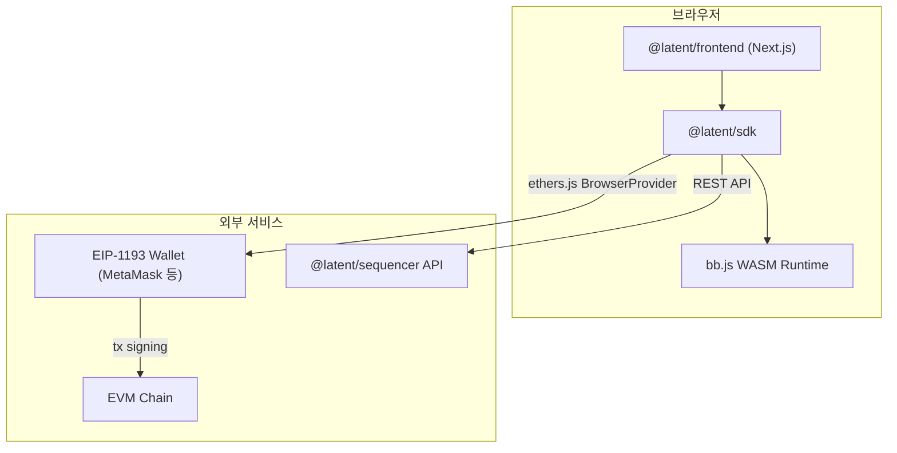
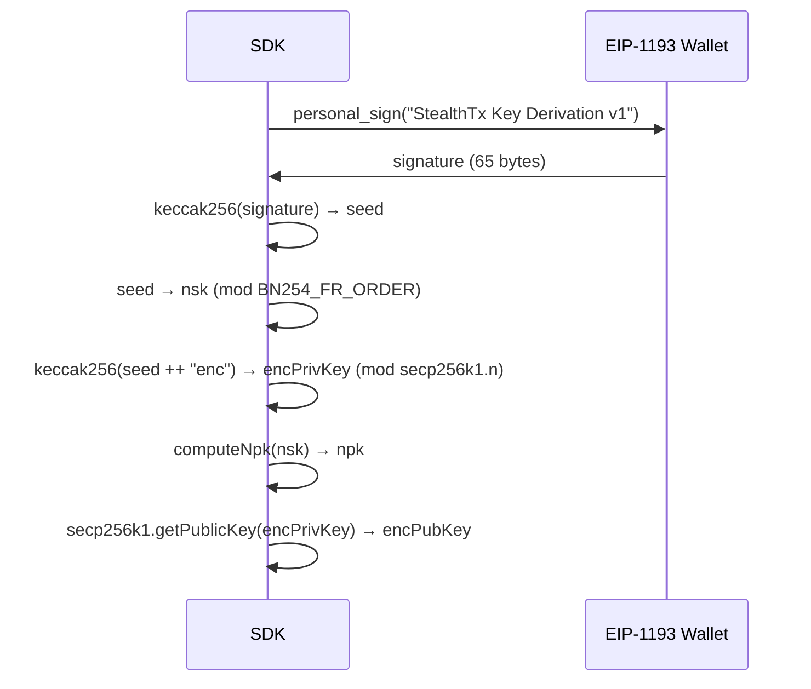
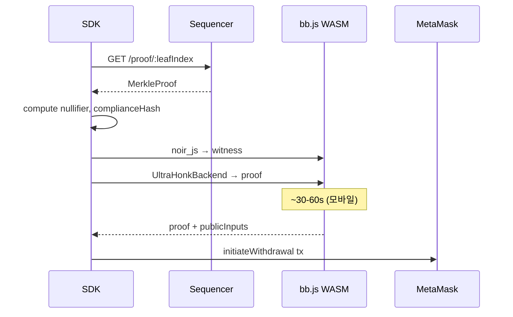

# Web SDK

> `packages/sdk/` — 브라우저 ZK proving + ethers.js 연동 TypeScript 라이브러리

## System Diagram



---

## Module Structure

```
packages/sdk/src/
├── index.ts               # Re-export barrel
├── client.ts              # LatentClient — 통합 Facade
├── core/
│   ├── crypto.ts          # 브라우저 Poseidon2 + ECIES (bb.js WASM)
│   ├── keys.ts            # EIP-1193 서명 → 키 파생
│   ├── merkle.ts          # Merkle Tree (full build + sparse proof)
│   ├── notes.ts           # Note 스캔/복호화 (client-side)
│   └── types.ts           # 공유 타입 + 상수 + conversion helpers
├── proving/
│   ├── witness.ts         # noir_js witness 생성
│   └── prover.ts          # UltraHonkBackend 증명 생성
├── chain/
│   ├── wallet.ts          # EIP-1193 지갑 연동 (ethers.js v6)
│   ├── contracts.ts       # PrivacyPoolV2 + ERC20 인터페이스
│   └── abi.ts             # ABI 상수
└── api/
    └── sequencer.ts       # Sequencer REST 클라이언트 (registration 포함)
```

---

## Key Derivation

EIP-1193 `personal_sign`으로 결정론적 Latent 키 파생:



- 동일 지갑 → 동일 키 (백업 불필요)
- 제3자는 개인키 없이 파생 불가 (ECDSA 보안)
- localStorage 캐싱 (prefix: `stealthtx_keys_v1_`)

---

## Note Scanning

시퀀서는 raw encrypted data만 제공. 필터링/복호화는 SDK에서 client-side 수행.

```
1. GET /notes?from=0&to=N → raw encrypted notes
2. view tag 필터링 (99.6% 스킵)
3. ECIES 복호화 → OwnedNote[]
```

서버에 사용자 개인키가 전송되지 않음.

---

## Proof Generation Pipeline



### 예상 증명 시간 (WASM 싱글스레드)

| 환경 | 시간 |
|------|------|
| 데스크톱 | ~5-15초 |
| 모바일 (최신) | ~30-60초 |
| 모바일 (중저가) | ~60-120초 |

---

## Recipient Key Sharing

온체인 레지스트리 없이 링크/QR로 직접 공유:

```
https://app.example.com/pay?npk=12345...&enc=0x02abc...
```

- `LatentClient.generatePaymentLink()` → 링크 생성
- `LatentClient.parsePaymentLink()` → 수신자 공개키 추출

---

## LatentClient API

```typescript
const client = new LatentClient({
  sequencerUrl: 'http://localhost:3000',
  poolAddress: '0x...',
  tokenAddress: '0x...',
  circuitUrl: '/circuit/latent_circuit.json',  // 선택
  operatorEncPubKey: '0x02abc...',             // operator ECIES 공개키 (선택)
})

await client.init()                    // crypto (Poseidon2 WASM) 초기화
await client.connect()                 // EIP-1193 지갑 연결
await client.deriveKeys()              // Latent 키 파생

const notes = await client.scanMyNotes()      // 내 노트 스캔
const balance = await client.getPrivacyBalance()

await client.deposit({ recipientNpk, recipientEncPubKey, amount })

await client.withdraw({
  note: notes[0],
  amount: 500000n,
  recipientAddress: '0x...',
  onProgress: (stage) => console.log(stage.message),
})

await client.claimWithdrawal(nullifier)  // 24h 후
```

### SequencerClient API

```typescript
const seq = new SequencerClient('http://localhost:3000')

// Tree queries
await seq.getRoot()                         // { root, leafCount, lastProcessedIndex }
await seq.getProof(leafIndex)               // MerkleProofResponse
await seq.getProofs(from, to)               // MerkleProofResponse[]

// Note retrieval
await seq.getNotes(from, to)                // StoredEncryptedNote[]

// Registration
await seq.getRegistrationRoot()             // { root, leafCount }
await seq.getRegistrationProof(npk)         // RegistrationProofResponse
await seq.registerUser(address, npk, encPubKey)

// Operator
await seq.getOperatorPubKey()               // hex string

// Health
await seq.getHealth()
await seq.getStats()
```

---

## Dependencies

| 패키지 | 버전 | 용도 |
|--------|------|------|
| `@aztec/bb.js` | `3.0.0-nightly.20260102` | UltraHonkBackend + BarretenbergSync (Poseidon2 WASM) |
| `@noir-lang/noir_js` | `1.0.0-beta.18` | Witness 생성 |
| `@noble/curves` | `^1.8.0` | secp256k1 ECIES |
| `@noble/hashes` | latest | HMAC-SHA256 (ECIES 인증) |
| `ethers` | `^6.16.0` | EIP-1193 BrowserProvider + 컨트랙트 |

> **참고**: Frontend(`packages/frontend/`)도 ethers.js를 사용한다 (wagmi/viem 미사용).

---

## Technical Risks

| 리스크 | 대응 |
|--------|------|
| SharedArrayBuffer 미지원 (MetaMask 인앱) | `threads: 1` 기본, feature detect |
| WASM 번들 크기 | lazy load (증명 필요 시 로드) |
| 모바일 메모리 부족 | 작은 SRS (2^18), 에러 핸들링 |
| 키 파생 결정론성 | EIP-191 personal_sign 표준, 교차 테스트 |
