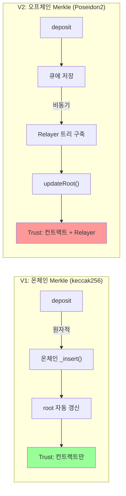

# Security Report: Poseidon2 Migration

> Latent Circuit + PrivacyPoolV2 보안 점검 — 2026-02-24

## 1. 요약

keccak256에서 Poseidon2로 해시 함수를 마이그레이션하면서 **성능은 30배 향상**되었으나, 새로운 보안 고려사항이 도입되었다. 이 리포트는 현재 구조의 취약점을 분류하고, 프로덕션 전환을 위한 개선 방안을 제시한다.

### 발견 요약

| 심각도 | 건수 | 핵심 항목 |
|--------|:----:|----------|
| **CRITICAL** | ~~1~~ 0 | ~~Relayer 무검증 root 제출~~ → **RESOLVED** (Dual-approval) |
| **HIGH** | ~~3~~ 1 | Sponge 비표준 구성, ~~ECIES 무인증~~ → **RESOLVED** (HMAC-SHA256), BigInt 모듈러 의존성 |
| **MEDIUM** | ~~4~~ 3 | 도메인 분리자, ~~recipient 절삭~~ → **RESOLVED** (160-bit range check), root 만료, 키 로테이션 |
| **LOW** | 4 | 프론트러닝, sponge IV, compliance hash 동어반복, sparse proof 오용 |

---

## 2. Poseidon2 암호학적 평가

### 2.1 현재 암호분석 상태

| 항목 | keccak256 | Poseidon2 (BN254, t=4) |
|------|-----------|------------------------|
| 목표 보안 수준 | 128-bit (collision) / 256-bit (pre-image) | 128-bit (양쪽 모두) |
| 분석 이력 | 15년+, NIST SHA-3 표준 (2015) | ~5년 (Poseidon 2019, Poseidon2 2023) |
| Full-round 공격 | 없음 | 없음 |
| 진행 중인 연구 | 대부분 종결 | **활발** (EF 바운티 2026년까지) |
| 공격 유형 | Differential/Linear (잘 알려짐) | **Algebraic** (Grobner, interpolation — 탐색 중) |

**핵심 연구 동향:**

- **Ethereum Foundation Poseidon Cryptanalysis Initiative** (2024-2026): $130K 바운티. Reduced-round 인스턴스에 대한 공격은 성공, **full-round 인스턴스는 미돌파**.
- **HADES 대수적 분석** (Ashur & Buschman, ACISP 2024): 보안 논증에서 gap 발견. 384-bit 이상에서 "원래 보안 논증이 실패하기 시작". 128-bit Latent 사용 사례에는 직접적 영향 없으나 마진이 기존 예측보다 줄어들 수 있음.
- **Graeffe 기반 공격** (2025): Reduced-round에 대해 wall time 2^13배 가속. Full-round에는 적용 불가.

**평가**: Poseidon2 128-bit 보안은 현재까지 유효하며 Aztec, Mina, SP1 등에서 프로덕션 사용 중. 그러나 keccak256 대비 암호학적 신뢰도 마진은 명확히 좁다.

### 2.2 Sponge Construction (t=4, rate=3, capacity=1)

현 회로는 `poseidon2_permutation`을 직접 사용한 수동 sponge 구현:

```
capacity = 1 field element ≈ 254 bits
collision resistance ≈ 2^(254/2) = 2^127 ✓ (128-bit 목표 충족)
```

**Noir stdlib 대비 차이점:**

| 항목 | Noir stdlib `Poseidon2::hash` | Latent 수동 구현 |
|------|------------------------------|--------------|
| IV (Initial Vector) | `state[3] = input_length * 2^64` | `state[3] = 0` |
| 길이 패딩 | 입력 후 `1` 추가 | 없음 |
| 결과 호환성 | 표준 출력 | **stdlib과 불일치** |

이 차이는 도메인 분리자 + 고정 길이 함수로 **현 회로 내에서는 안전**하지만, 표준 Poseidon2 해시와의 상호운용성을 차단하고 방어 심층이 약해진다.

### 2.3 도메인 분리자 분석

현 구현:
```noir
DOMAIN_COMMITMENT = 1, DOMAIN_NULLIFIER = 2, DOMAIN_MERKLE = 3,
DOMAIN_COMPLIANCE = 4, DOMAIN_NPK = 5
```

| 평가 항목 | 상태 |
|----------|------|
| 5개 용도 간 구분 | O (모두 다른 값) |
| 사용자 입력과 충돌 가능성 | 이론적 존재 (1-5는 유효한 Field 값) |
| 업계 권장 수준 | 미달 (SAFE 표준은 구조적 상수 권장) |

**권장**: NUMS(Nothing-Up-My-Sleeve) 방식으로 큰 상수 사용. 예: `domain = hash("latent.commitment.v1") % p`

---

## 3. 취약점 상세

### 3.1 [RESOLVED] Relayer 무검증 Root 제출

**이전 상태**: `updateRoot()`에서 relayer가 제출하는 root를 검증 없이 수락. 단일 키 탈취 시 풀 자금 탈취 가능.

**해결 (ADR-001 업데이트)**: Dual-approval 패턴 적용. `updateRoot()` → `proposeRoot()` + `confirmRoot()` 분리.

```solidity
function proposeRoot(bytes32 newRoot, uint256 processedUpTo) external;  // relayer only
function confirmRoot(bytes32 expectedRoot, uint256 expectedProcessedUpTo) external;  // operator only
```

- Relayer가 root를 제안하면, operator가 독립적으로 Merkle tree를 계산한 후 동일한 root/processedUpTo를 제출해야 확정
- Operator의 `expectedRoot`가 relayer의 제안과 일치하지 않으면 revert
- 단일 키 탈취로는 root 위조 불가 (relayer + operator 모두 타협 필요)
- `cancelProposedRoot()`로 잘못된 제안 취소 가능

### 3.2 [HIGH] Sponge 비표준 구성 — Cross-Length Collision

**위치**: `main.nr:85-103`

```noir
poseidon2_hash_2(a, b)       → permute([a, b, 0, 0])[0]
poseidon2_hash_3(a, b, 0)   → permute([a, b, 0, 0])[0]  // 동일!
```

길이 패딩이 없어 `hash_2(x, y) == hash_3(x, y, 0)` 이 성립한다.

**현재 위험도**: 도메인 분리자가 항상 0이 아닌 값(1-5)이므로 실제 회로 내에서는 충돌 불가. 그러나:
- 향후 도메인 분리자 `0` 사용 시 즉시 취약
- 표준 sponge 보안 증명(indifferentiability)이 적용되지 않음

**대응**: stdlib의 IV 인코딩(`input_length * 2^64`을 capacity에 설정) 적용 또는 명시적 length suffix 추가.

### 3.3 [RESOLVED] ECIES 무인증 암호화

**이전 상태**: XOR 스트림 암호에 MAC이 없어 ciphertext가 malleable. 비트 플립 공격으로 복호화 값 변조 가능.

**해결 (ADR-004)**: HMAC-SHA256 인증 추가. KDF에서 encryption key + MAC key를 분리 파생.

```
KDF: deriveKeyMaterial(sharedSecret, encLen + 32)
  → encKey = keyMaterial[0..encLen]
  → macKey = keyMaterial[encLen..encLen+32]
MAC: HMAC-SHA256(macKey, ciphertext) → 32 bytes
Decrypt: MAC 검증 → XOR 복호화 (constant-time 비교)
```

- Recipient note: `[ephPubKey(33B) | ciphertext(128B) | mac(32B) | viewTag(1B)]` = 194B
- Operator note: `[ephPubKey(33B) | ciphertext(32B) | mac(32B)]` = 97B
- 변조 시도 시 `ECIES: MAC verification failed` 에러로 즉시 거부

### 3.4 [HIGH] BigInt 모듈러 리덕션 의존

**위치**: `packages/sequencer/src/crypto.ts:63-68`

```typescript
state[0] += d;  // JavaScript BigInt 덧셈 (mod p 아님)
state = poseidon2Permutation(state);  // Fr 생성자가 mod p 수행?
```

`state[0] + d`가 BN254 모듈러스 `p`를 초과하면 표준 정수 합이 된다. `@aztec/foundation`의 `Fr` 생성자가 `mod p`를 수행하는지에 의존하는 **암묵적 계약**.

**현재 상태**: 테스트 벡터가 `nargo execute`를 통과하므로 실제로는 정상 동작. 그러나 라이브러리 업데이트 시 깨질 수 있는 취약한 의존성.

**대응**: 명시적 `% p` 연산 추가 또는 `Fr` wrapping 함수 사용.

### 3.5 [RESOLVED] Recipient 주소 절삭

**이전 상태**: 254-bit Field를 160-bit address로 절삭 시 compliance hash와 실제 수신자 불일치 가능.

**해결**: 회로 내 160-bit 범위 검증 추가. `to_be_bytes::<20>`가 값이 20바이트에 수렴하는지 제약.

```noir
// 4.5 Verify recipient fits in 160 bits (Ethereum address range)
let _: [u8; 20] = recipient.to_be_bytes();
```

- `recipient >= 2^160`이면 회로 실행 시 constraint failure
- 공격 시나리오 (`2^160 + addr` → Solidity에서 `addr`로 절삭) 완전 차단
- 테스트: boundary values (0, 1, 2^159, 2^160-1) + attack vectors (2^160+0xA11CE, p-1)

### 3.6 [MEDIUM] Root 영구 유효

**위치**: `PrivacyPoolV2.sol:91`

`knownRoots`에 한 번 등록된 root는 영구 유효. 악의적 relayer가 교체된 후에도 이전에 제출한 위조 root가 계속 사용 가능.

**대응**: Root history에 TTL 적용 또는 Tornado Cash 방식의 최근 N개 root만 유효하게 제한.

### 3.7 [MEDIUM → PARTIAL] Relayer/Operator 키 로테이션

**위치**: `PrivacyPoolV2.sol:19-20`

```solidity
address public operator;
address public relayer;
```

**Relayer**: `setRelayer()` 함수 추가됨 — Relayer 본인이 새 주소로 이전 가능 (EOA → multisig 마이그레이션 등).

**Operator**: 키 교체 함수 아직 없음. 키 유출 시 컨트랙트 재배포 필요.

**잔여 대응**: `updateOperator` 함수 추가 (timelock 포함).

### 3.8 [RESOLVED] Compliance Hash Brute-Force 위험

**이전 상태**: `compliance_hash = poseidon2(depositor, recipient, amount, DOMAIN_COMPLIANCE)`의 모든 입력이 공개 정보(deposit event의 msg.sender, withdrawal event의 recipient/amount)여서, Observer가 depositor를 순회하면 depositor↔recipient 연결 가능.

**해결 (ADR-003)**: `secret`을 salt로 추가. `compliance_hash = poseidon2(depositor, recipient, amount, secret, DOMAIN_COMPLIANCE)`. Observer는 `secret`을 모르므로 brute-force 불가. Operator는 operator note (ECIES 암호화)를 통해 `secret`을 복호화하여 검증 가능.

추가로, `secret`이나 `nsk`의 엔트로피가 낮으면 commitment brute-force가 가능하므로 128-bit+ CSPRNG 사용 권장.

---

## 4. 아키텍처 변경에 따른 신뢰 모델 비교



| 속성 | V1 (keccak256, 온체인) | V2 (Poseidon2, 오프체인) |
|------|----------------------|------------------------|
| Root 정합성 | **보장** (코드가 계산) | **미보장** (relayer 신뢰) |
| 검열 저항 | 높음 (deposit = 즉시 트리 삽입) | 낮음 (relayer가 누락 가능) |
| 가용성 | 높음 (블록체인 가동 시) | relayer 의존 |
| 가스 비용 | 높음 (~300K/deposit) | 낮음 (~60K/deposit) |
| 증명 시간 | 5.14s | **0.18s** |
| 메모리 | 1.74GB | **34MB** |

---

## 5. 프로덕션 전 필수 조치

### P0 (배포 차단) — ALL RESOLVED

| # | 항목 | 대응 | 상태 |
|---|------|------|:----:|
| 1 | Relayer root 검증 | Dual-approval: `proposeRoot` (relayer) + `confirmRoot` (operator) | **RESOLVED** |
| 2 | ECIES 인증 | HMAC-SHA256 MAC 추가 (ADR-004) | **RESOLVED** |
| 3 | Recipient 범위 검증 | 회로 내 `to_be_bytes::<20>` 160-bit range check | **RESOLVED** |

### P1 (배포 전 권장)

| # | 항목 | 대응 |
|---|------|------|
| 4 | Sponge IV 표준화 | stdlib 방식 IV 인코딩 적용 |
| 5 | 도메인 분리자 강화 | NUMS 기반 대형 상수 |
| 6 | Root TTL | 최근 N개 root만 유효 |
| 7 | Operator 키 로테이션 | updateOperator + timelock (setRelayer는 구현 완료) |

### P2 (운영 중 개선)

| # | 항목 | 대응 |
|---|------|------|
| 9 | BigInt mod p 명시화 | 암묵적 Fr 의존 제거 |
| 10 | Forced inclusion | 검열 저항 온체인 fallback |
| 11 | Multi-relayer | 단일 장애점 제거 |

---

## 6. 참고 문헌

- [Poseidon Cryptanalysis Initiative (Ethereum Foundation)](https://www.poseidon-initiative.info/)
- [Poseidon2: A Faster Version of the Poseidon Hash Function (ePrint 2023/323)](https://eprint.iacr.org/2023/323.pdf)
- [Algebraic Cryptanalysis of HADES (ACISP 2024)](https://dl.acm.org/doi/10.1007/978-981-97-5028-3_12)
- [SAFE: Sponge API for Field Elements (ePrint 2023/522)](https://eprint.iacr.org/2023/522.pdf)
- [A Developer's Guide to Building Safe Noir Circuits (OpenZeppelin)](https://www.openzeppelin.com/news/developer-guide-to-building-safe-noir-circuits)
- [Graeffe-Based Attacks on Poseidon (ePrint 2025/937)](https://eprint.iacr.org/2025/937.pdf)
- [ZK Circuit Security Guide (Nethermind)](https://www.nethermind.io/blog/zk-circuit-security-a-guide-for-engineers-and-architects)
- [0xPARC ZK Bug Tracker](https://github.com/0xPARC/zk-bug-tracker)
