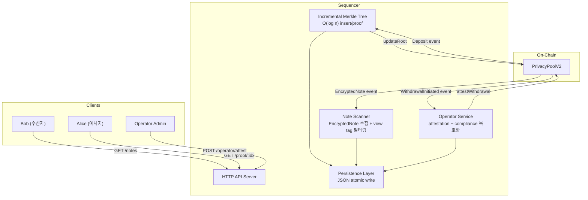
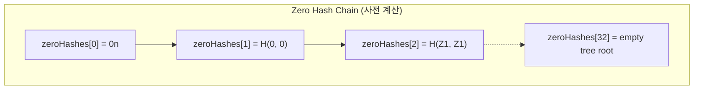
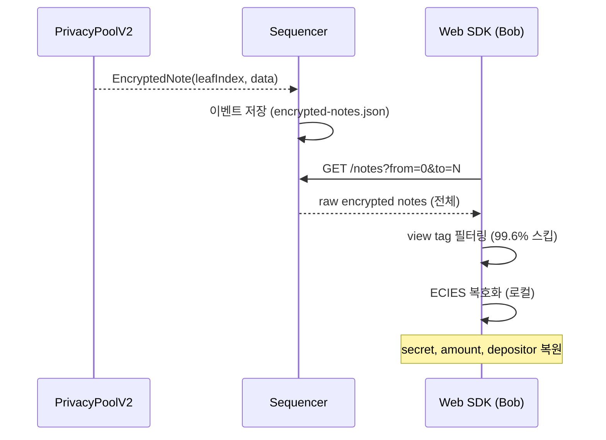
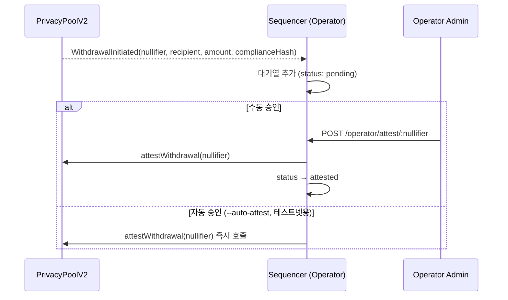
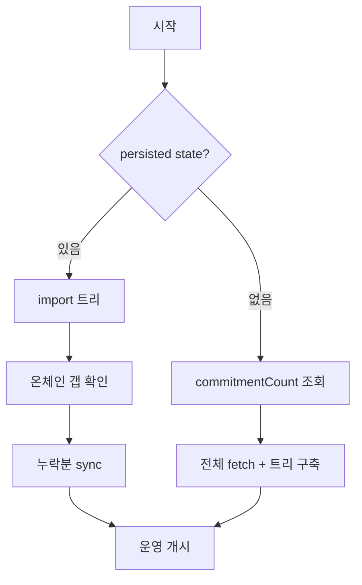
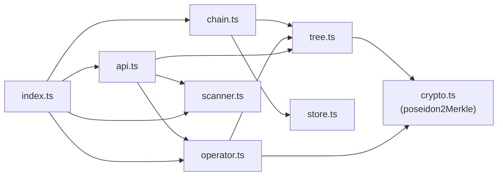

# Sequencer Service 설계

> `packages/sequencer/` — 통합 오프체인 서비스 (Incremental Merkle Tree + Note Scanner + Operator + Registration Tree)

## 1. 배경: Relayer의 한계

기존 `scripts/relayer.ts`는 개념 검증(PoC)용으로 다음과 같은 근본적 한계가 있었다:

| 문제 | 영향 |
|------|------|
| `buildMerkleTree()`가 `2^32` 배열 할당 | depth 32에서 ~400GB 메모리 필요 → 실행 불가 |
| 매 deposit마다 전체 트리 재구축 | O(n·log n) vs O(log n) |
| 인메모리 전용 | 재시작 시 전체 재동기화 |
| 단일 역할 (root 제출만) | Note 스캐닝, Operator 기능 별도 운영 필요 |
| 배치 처리 없음 | deposit마다 트랜잭션 비용 발생 |

## 2. 시퀀서 아키텍처

3가지 역할을 단일 프로세스로 통합:



### 기존 Relayer와의 비교

| 항목 | Relayer | Sequencer |
|------|---------|-----------|
| Merkle Tree | `buildMerkleTree()` — 전체 재구축 | `IncrementalMerkleTree` — O(log n) |
| 메모리 | O(2^depth) 배열 | Map — non-default 노드만 |
| 영속성 | 없음 (인메모리) | JSON 파일 (atomic write) |
| Root 제출 | deposit마다 즉시 | 배치 (count/time 트리거) |
| Note 스캐닝 | 없음 | view tag 필터링 API |
| Operator | 없음 | attestation + compliance 복호화 |
| Registration | 없음 | Registration Tree (depth 16) + 자동 등록 |
| HTTP API | 3개 엔드포인트 | 16개 엔드포인트 (하위 호환 + registration) |

---

## 3. 모듈 상세

### 3.1 Incremental Merkle Tree (`tree.ts`)

기존 `buildMerkleTree()`를 대체하는 핵심 자료구조.

**원리**: Zero hash chain을 사전 계산하고, `Map<"level:index", bigint>`로 non-default 노드만 저장.



**Insert 알고리즘** (O(log n)):
```
insert(leaf):
  nodes["0:leafIndex"] = leaf
  current = leaf, idx = leafIndex
  for level 0..31:
    siblingIdx = idx XOR 1
    sibling = nodes["level:siblingIdx"] ?? zeroHashes[level]
    parent = idx%2==0 ? H(current, sibling) : H(sibling, current)
    nodes["level+1:floor(idx/2)"] = parent
    current = parent, idx = floor(idx/2)
  root = current
```

**호환성**: `poseidon2Merkle(left, right)`는 `packages/sequencer/src/crypto.ts`를 사용. 회로(`main.nr`)의 `path_indices` 규약(0=left child, 1=right child)과 동일.

**검증 완료**: depth 10에서 `buildMerkleTree()`와 1~100 leaves 비교, 랜덤 필드, 직렬화 라운드트립 — 31개 테스트 통과.

### 3.2 Note Scanner (`scanner.ts`)

EncryptedNote 이벤트를 수집하여 raw 데이터로 제공. **view tag 필터링과 복호화는 클라이언트(SDK)에서 수행**.



**프라이버시**: 서버는 raw 데이터만 제공. 사용자의 개인키가 서버에 전송되지 않음.

**EncryptedNote 포맷**:
```
Recipient note: [ephPubKey (33B) | ciphertext (128B) | viewTag (1B)] = 162 bytes
Operator note:  [ephPubKey (33B) | ciphertext (32B)]                 =  65 bytes
Full payload:   [recipientNote (162B) | operatorNote (65B)]           = 227 bytes
```
- 하위 호환: 162B(legacy) vs 227B(new) — payload 길이로 판별

### 3.3 Operator Service (`operator.ts`)

운영자 역할을 시퀀서에 통합.



**상태 머신**: `pending → attested → claimed` 또는 `pending → expired`

### 3.4 Persistence (`store.ts`)

JSON 파일 기반, atomic write (temp 파일 → rename):

```
data/sequencer/
  state.json            # 트리 노드 + 동기화 진행 상태
  encrypted-notes.json  # EncryptedNote 이벤트 데이터
  withdrawals.json      # PendingWithdrawal 상태
```

### 3.5 Chain Sync (`chain.ts`)

**복구 전략**:


---

## 4. HTTP API

### Relayer 호환 (기존 클라이언트 변경 없음)

| Method | Endpoint | 설명 |
|--------|----------|------|
| GET | `/health` | `{ status, leafCount }` |
| GET | `/root` | `{ root, leafCount, lastProcessedIndex }` |
| GET | `/proof/:leafIndex` | `{ root, leafIndex, commitment, siblings, pathIndices }` |

### Merkle 신규

| Method | Endpoint | 설명 |
|--------|----------|------|
| GET | `/stats` | `{ treeDepth, totalLeaves, pendingDeposits, uptimeSeconds, ... }` |
| GET | `/proofs?from=0&to=10` | 배치 proof 조회 |

### Note Scanner

| Method | Endpoint | 설명 |
|--------|----------|------|
| GET | `/notes?from=0&to=100` | 범위 내 encrypted notes (raw data) |

> `/notes/scan` (서버 측 view tag 필터링) 엔드포인트는 프라이버시 이유로 제거됨.
> 필터링은 SDK에서 클라이언트 로컬로 수행.

### Registration (공개)

| Method | Endpoint | 설명 |
|--------|----------|------|
| GET | `/registration/root` | Registration Tree 현재 root + leaf count |
| GET | `/registration/proof/:npk` | NPK에 대한 Registration Merkle proof |

### Operator (공개)

| Method | Endpoint | 설명 |
|--------|----------|------|
| GET | `/operator/pubkey` | Operator ECIES 암호화 공개키 (인증 불필요) |

### Operator (인증 필요)

| Method | Endpoint | 설명 |
|--------|----------|------|
| POST | `/operator/register` | KYC 사용자 등록 |
| GET | `/operator/users` | 등록된 사용자 목록 |
| GET | `/operator/withdrawals` | pending 출금 목록 |
| GET | `/operator/withdrawals/:nullifier` | 특정 출금 상세 |
| POST | `/operator/attest/:nullifier` | attestation 실행 |
| POST | `/operator/decrypt` | compliance 복호화 (body: `{ ciphertext, ephemeralPubKey, mac }`) |

---

## 5. CLI

```bash
npx tsx packages/sequencer/src/index.ts \
  --rpc <RPC_URL> \                      # 필수: RPC 엔드포인트
  --pool <POOL_ADDRESS> \                # 필수: PrivacyPoolV2 주소
  --relayer-key <RELAYER_PRIVATE_KEY> \  # 필수: root 제안용 키
  --operator-key <OPERATOR_PRIVATE_KEY>\ # 선택: confirmRoot + attestation용 키
  --port 3000 \                          # HTTP API 포트
  --poll 5000 \                          # 폴링 간격 (ms)
  --batch-size 100 \                     # 배치 크기
  --batch-timeout 30000 \               # 배치 타임아웃 (ms)
  --data-dir ./data/sequencer \          # 영속성 디렉토리
  --confirmations 2 \                    # 블록 확인 수
  --auto-attest \                        # 테스트넷 자동 승인
  --auth-token <TOKEN>                   # operator API 인증 토큰
```

**최소 실행**: `--rpc`, `--pool`, `--relayer-key`만 필수. Operator 기능은 `--operator-key` 제공 시에만 활성화.

---

## 6. 파일 구조

```
packages/sequencer/
  src/
    index.ts            # 엔트리포인트, CLI, 메인 루프
    tree.ts             # IncrementalMerkleTree 클래스
    store.ts            # 영속성 (JSON atomic write)
    chain.ts            # 체인 동기화, root 제출, 배치 처리
    scanner.ts          # Note 스캐닝 (EncryptedNote 수집/조회)
    operator.ts         # Operator 서비스 (attestation + compliance + registration)
    api.ts              # HTTP API 서버 (16 endpoints)
    crypto.ts           # Poseidon2 + ECIES (Node.js, @aztec/foundation)
    types.ts            # 공유 인터페이스
  __tests__/
    tree.test.ts                # 트리 정합성 테스트 (12 tests)
    scanner.test.ts             # Note 스캐닝 테스트 (8 tests)
    operator.test.ts            # Operator 로직 테스트 (35 tests)
    registration-tree.test.ts   # Registration Tree 테스트 (16 tests)
```

**의존 관계**:



---

## 7. 검증

| # | 검증 항목 | 방법 | 상태 |
|---|----------|------|:----:|
| 1 | 트리 정합성 | depth 10에서 `IncrementalMerkleTree` vs `buildMerkleTree()` (1~100 leaves) | ✅ |
| 2 | 랜덤 필드 | BN254 modulus 내 랜덤 30 leaves 비교 | ✅ |
| 3 | Proof 호환성 | incremental proof → manual root recompute 검증 | ✅ |
| 4 | 직렬화 | export → JSON → import → continued insertion | ✅ |
| 5 | Note 저장/조회 | EncryptedNote 저장 → 범위 조회 → noteCount 확인 | ✅ |
| 6 | Operator 상태 | status 전이, 필터링, 영속성 라운드트립 | ✅ |
| 7 | Registration Tree | insert, proof 생성, root 갱신, 직렬화, 중복 방지 | ✅ |

```bash
# 테스트 실행
npm run test:sequencer

# 시퀀서 시작 (개발)
npm run dev:sequencer

# 시퀀서 시작 (직접)
npx tsx packages/sequencer/src/index.ts --rpc <URL> --pool <ADDR> --relayer-key <KEY>
```
