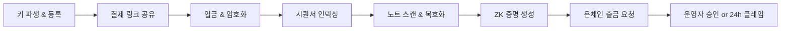
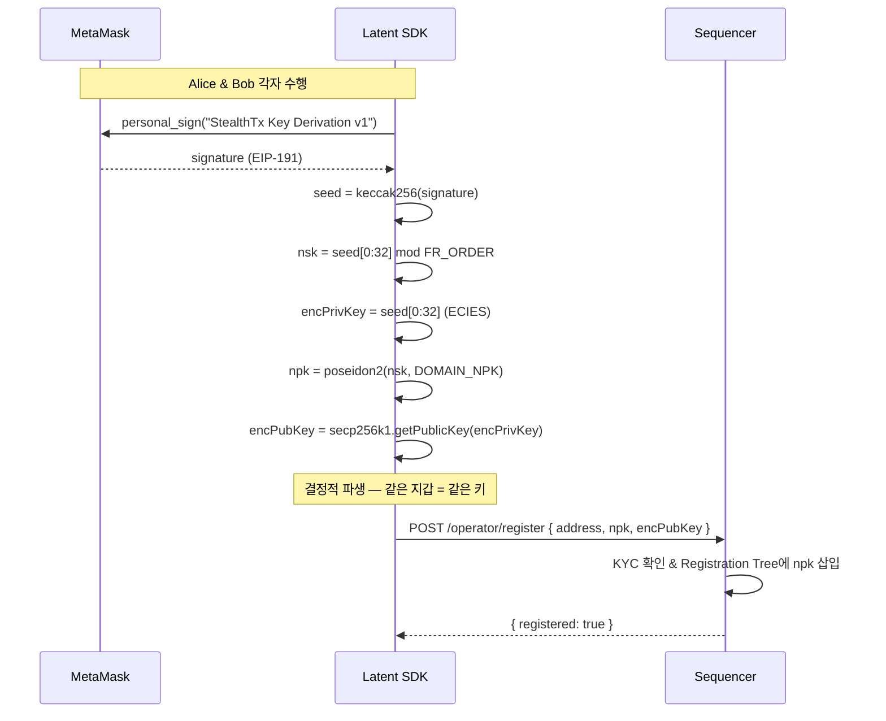
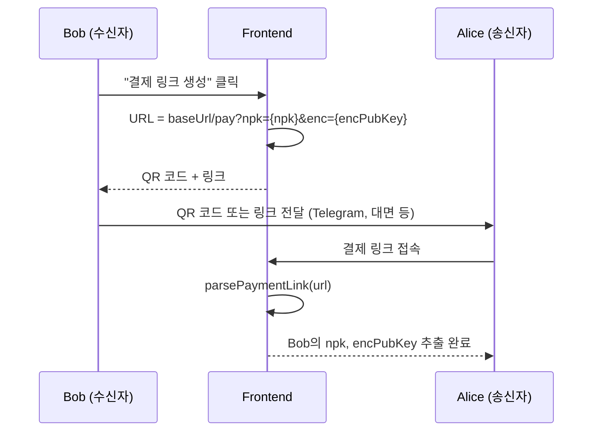
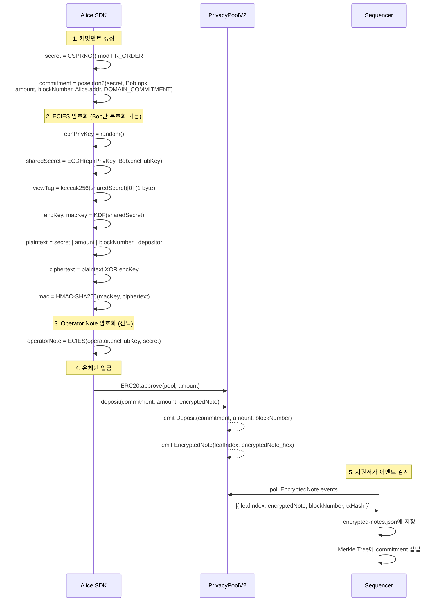
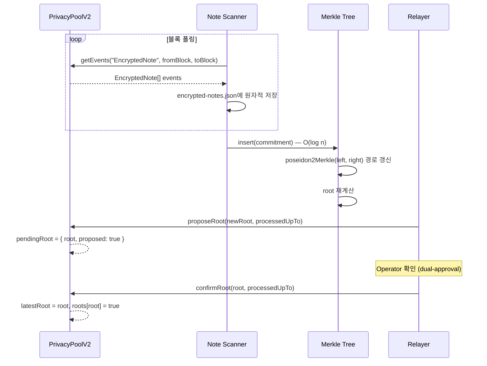
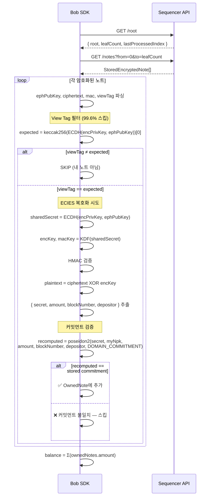
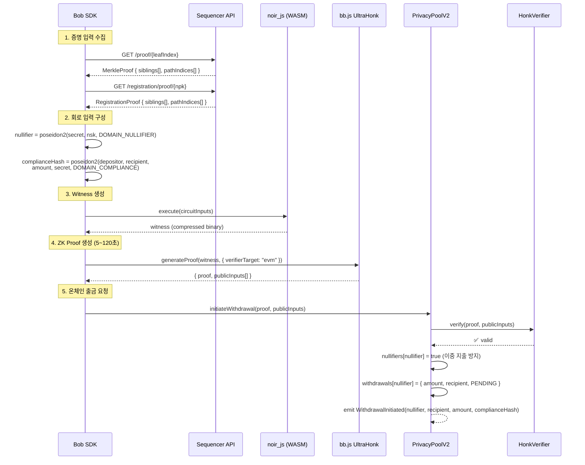
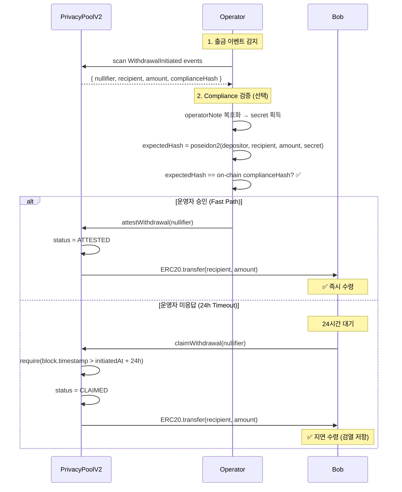
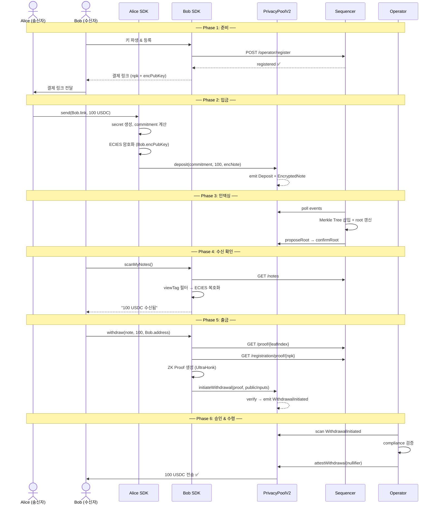

# Transfer Sequence: Alice → Bob

> Alice가 Bob에게 프라이버시를 보존하며 토큰을 송금하는 전체 흐름

## 1. 전체 흐름 요약



| 단계 | 주체 | 프라이버시 메커니즘 |
|------|------|-------------------|
| 키 파생 | Alice, Bob 각자 | EIP-191 서명 → 결정적 키 쌍 |
| 결제 링크 | Bob → Alice | 공개키만 노출 (npk + encPubKey) |
| 입금 | Alice | Poseidon2 커밋먼트 + ECIES 암호화 |
| 인덱싱 | 시퀀서 | 암호화된 노트만 저장 (복호화 불가) |
| 스캔 | Bob 클라이언트 | View tag 필터 + ECIES 로컬 복호화 |
| 증명 | Bob 클라이언트 | UltraHonk ZK proof (6개 제약조건) |
| 출금 | Bob → 온체인 | Nullifier로 이중 지출 방지 |
| 승인 | 운영자 or 타임아웃 | Compliance hash 검증 + 검열 저항 |

## 2. Phase 1: 키 파생 & 등록

Alice와 Bob 모두 동일한 키 파생 과정을 거친다.



**핵심 포인트**:
- `nsk`(nullifier secret key)는 절대 외부에 노출되지 않음
- `npk`, `encPubKey`만 공개되며, 이것으로 비밀키를 역산할 수 없음
- Registration Tree 등록은 KYC 게이트 역할 — 미등록 사용자는 출금 불가

## 3. Phase 2: 결제 링크 공유



**Why 결제 링크?**: Bob의 공개키를 안전하게 전달하는 최소한의 방법. 링크에는 비밀키가 포함되지 않으므로 유출되어도 자금 위험 없음.

## 4. Phase 3: 입금 (Alice → Privacy Pool)



### 암호화 데이터 구조

```
EncryptedNote (194 bytes):
┌──────────────────┬────────────┬─────────┬──────────┐
│ ephemeralPubKey  │ ciphertext │   mac   │ viewTag  │
│    (33 bytes)    │ (128 bytes)│(32 bytes)│ (1 byte) │
└──────────────────┴────────────┴─────────┴──────────┘

ciphertext 복호화 후:
┌──────────┬──────────┬─────────────┬───────────┐
│  secret  │  amount  │ blockNumber │ depositor │
│ (32 bytes)│(32 bytes)│  (32 bytes) │ (32 bytes)│
└──────────┴──────────┴─────────────┴───────────┘
```

## 5. Phase 4: 시퀀서 인덱싱 & Merkle Root 배치



**Why Incremental Merkle Tree?**: 리프 삽입이 O(log n)이므로 전체 트리 재구축(O(n·log n)) 대비 효율적. 상태는 `state.json`에 영속화되어 재시작 시 체인과 동기화.

## 6. Phase 5: Bob의 노트 스캔 & 복호화



**Why 클라이언트 사이드 스캔?**: 서버는 암호화된 노트만 저장하고 복호화 키를 알 수 없음. Bob의 `encPrivKey`는 브라우저를 떠나지 않으므로 서버 침해 시에도 프라이버시 유지.

## 7. Phase 6: ZK 증명 생성 & 출금



### 회로 제약조건 (6개)

| # | 제약조건 | 검증 내용 |
|---|---------|----------|
| 1 | Nullifier 파생 | `nullifier == poseidon2(secret, nsk, DOMAIN_NULLIFIER)` |
| 2 | NPK 정확성 | `npk == poseidon2(nsk, DOMAIN_NPK)` |
| 3 | Merkle 포함 | `commitment ∈ Merkle Tree (root 검증)` |
| 4 | 금액 일관성 | `transferAmount ≤ noteAmount` |
| 5 | Compliance Hash | `hash == poseidon2(depositor, recipient, amount, secret, DOMAIN_COMPLIANCE)` |
| 6 | 등록 확인 | `npk ∈ Registration Tree` |

## 8. Phase 7: 운영자 승인 & 토큰 수령



**Why 2-Stage Withdrawal?**:
- **Fast Path**: 운영자가 compliance 확인 후 즉시 승인 → 사용자 경험 최적화
- **Timeout Path**: 운영자가 악의적으로 거부해도 24시간 후 자동 클레임 → 검열 저항

## 9. 전체 시퀀스 다이어그램 (End-to-End)



## 10. 프라이버시 & 보안 속성 요약

| 속성 | 메커니즘 | 외부 관찰자 | 수신자 | 운영자 |
|------|---------|-----------|--------|--------|
| **송신자 익명** | ZK proof (nullifier) | ❌ 불가 | ❌ 불가 | ✅ 가능 |
| **수신자 익명** | ECIES + stealth address | ❌ 불가 | ✅ 본인 | ✅ 가능 |
| **금액 은닉** | commitment 해시 | ❌ 불가 | ✅ 복호화 | ✅ 가능 |
| **이중 지출 방지** | on-chain nullifier 레지스트리 | — | — | — |
| **검열 저항** | 24h timeout 자동 클레임 | — | ✅ | — |
| **규제 준수** | compliance hash + operator note | — | — | ✅ 검증 |
