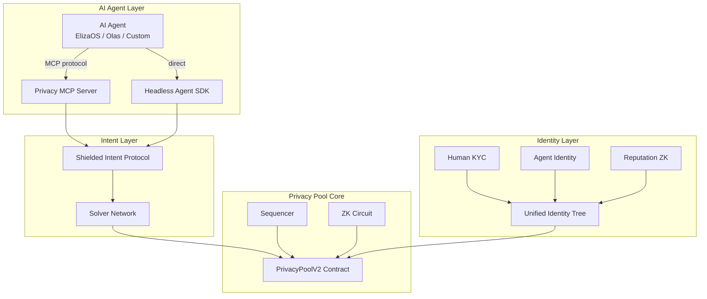
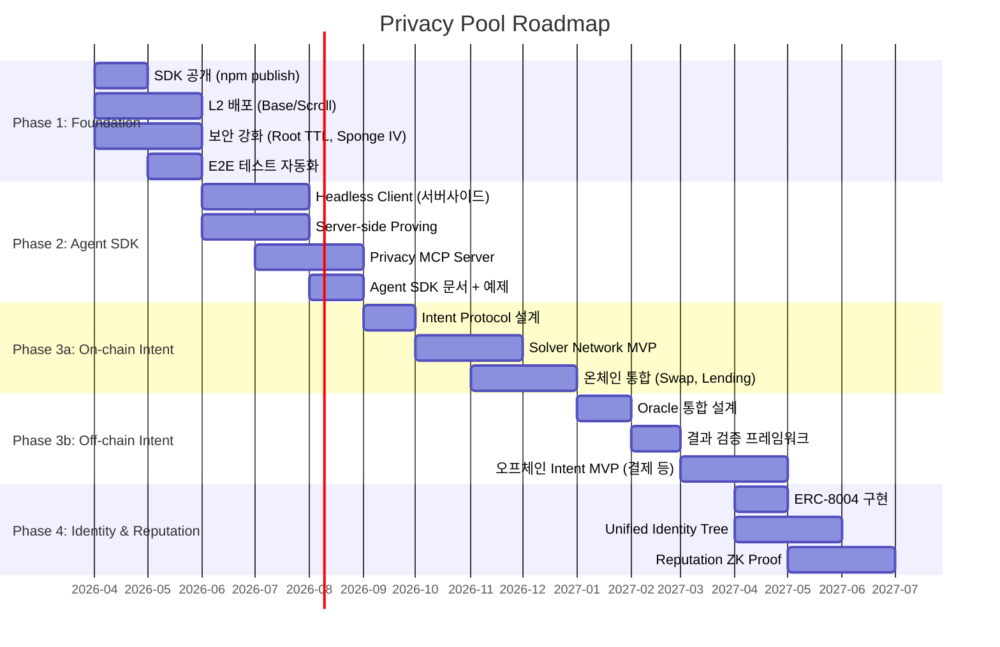
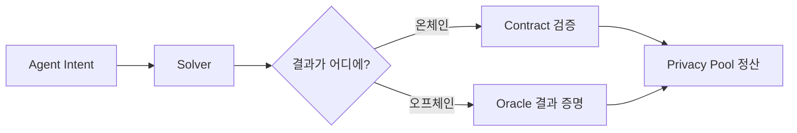

# Privacy Pool 로드맵

> AI Agent를 위한 프라이빗 DeFi 실행 레이어

## 비전 & 포지셔닝

Privacy Pool은 **AI Agent가 DeFi를 프라이빗하게 실행할 수 있는 인프라**를 목표로 한다.

**왜 지금인가?**
- Privacy Pool 구현체가 시장에 거의 없음 (0xbow 외 실서비스 전무)
- AI Agent + Privacy는 미개척 영역 — Agent의 온체인 행동은 완전히 투명하여 MEV, 프론트러닝, 전략 노출에 취약
- 규제 준수형 프라이버시(Compliant Privacy)가 유일한 생존 가능 경로 — 완전 익명은 규제 압력에 실패

**3축 전략:**

| 축 | 설명 | 핵심 가치 |
|---|---|---|
| **Shielded Intent Solver** | Agent의 DeFi 액션을 프라이빗하게 실행 | MEV 보호, 전략 은닉 |
| **Privacy MCP Server** | AI Agent가 Privacy Pool을 도구로 사용 | Agent 생태계 직접 접근 |
| **Unified Identity Tree** | Human KYC + Agent Identity + Reputation | 규제 준수 + Agent 신뢰 |

## 레포지토리 전략

| 레포 | 스코프 | Phase |
|------|--------|-------|
| [`joey-to-nexus/privacy-pool`](https://github.com/joey-to-nexus/privacy-pool) | Core: Circuit, Contract, SDK, Sequencer, Frontend | Phase 1-2 |
| [`joey-to-nexus/shielded-intent`](https://github.com/joey-to-nexus/shielded-intent) | Intent Protocol, Solver, Oracle 통합 | Phase 3a-3b |
| [`joey-to-nexus/stealth-id`](https://github.com/joey-to-nexus/stealth-id) | ZKP-native portable credential (KYC 재사용, 감사 레이어) | Phase 4 |

**분리 이유:**
- Privacy Pool Core는 검증된 PoC — 안정성 유지 우선
- Intent Solving은 탐색 단계 — 리서치, 실험, 방향 전환이 잦음
- StealthID는 법적 구조(FATF R17) + KYC 통합이 독립적 리서치 필요
- 의존 방향이 단방향: `shielded-intent`, `stealth-id` → `@to-nexus/privacy-pool-sdk`

**연결 방식:** Phase 1에서 SDK를 npm 공개한 후, 각 레포가 의존성으로 사용

## 현재 상태 (As-Is)

PoC 완성 단계. 핵심 프리미티브가 동작하며, 테스트 커버리지 확보됨.

| 컴포넌트 | 상태 | 테스트 |
|----------|------|--------|
| ZK Circuit (Noir) | 6 제약조건 완성 | 38 tests |
| Smart Contracts (Solidity) | PrivacyPoolV2 + UltraVerifier | 73 tests |
| Web SDK | 브라우저 ZK proving + MetaMask | 76 tests |
| Sequencer | Merkle Tree + Scanner + Operator | 83 tests |
| Frontend | Next.js 16, deposit/withdrawal 플로우 | 동작 확인 |

**아키텍처 요약:**
- 4계층 프라이버시: Privacy Pool (Merkle+ZK) → 2-Stage Withdrawal → Stealth Address → Compliance Hash
- Dual-Approval Root ([ADR-001](./adr/001-merkle-root-integrity.md))
- Registration Tree ([ADR-002](./adr/002-registration-tree.md))
- Compliance Hash Salt ([ADR-003](./adr/003-compliance-hash-salt.md))
- ECIES HMAC ([ADR-004](./adr/004-ecies-hmac-authentication.md))

## 목표 상태 (To-Be)

## Phase 로드맵

## 기능별 상세

### Phase 1: Foundation

기존 PoC를 프로덕션 수준으로 끌어올리는 단계.

#### SDK 공개 (npm publish)
- **목적**: 외부 개발자/Agent가 Privacy Pool을 프로그래밍 방식으로 사용
- **의존성**: 현재 SDK 코드 정리, API 안정화
- **산출물**: `@to-nexus/privacy-pool-sdk` npm 패키지
- **관련**: [design/sdk.md](./design/sdk.md)

#### L2 배포
- **목적**: 가스비 절감, 실사용 가능한 환경 확보
- **의존성**: L2 체인 선정 (Base, Scroll, Linea 후보), UltraVerifier 가스 프로파일링
- **산출물**: L2 메인넷 배포 + 검증된 컨트랙트
- **관련**: [design/contracts.md](./design/contracts.md)

#### 보안 강화
- **목적**: [보안 분석](./design/security.md)에서 식별된 P1/P2 항목 해결
- **항목**:
  - Root TTL 도입 (오래된 root 만료)
  - Sponge IV 표준화 (Noir stdlib과 일치)
  - Domain separator를 NUMS 포인트로 전환
  - Operator 키 로테이션 메커니즘
- **관련**: [design/security.md](./design/security.md)

#### E2E 테스트 자동화
- **목적**: CI에서 전체 플로우(deposit → withdrawal) 자동 검증
- **의존성**: Docker 환경, 로컬 체인 (Anvil)
- **산출물**: GitHub Actions CI 파이프라인

### Phase 2: Agent SDK

AI Agent가 Privacy Pool을 프로그래밍 방식으로 사용할 수 있는 인터페이스 구축.

#### Headless Client
- **목적**: 브라우저 없이 서버에서 Privacy Pool 사용 (Agent 핵심 요구사항)
- **변경점**: MetaMask 의존성 제거, 프라이빗 키 직접 서명, Node.js 네이티브 환경
- **의존성**: SDK 공개 (Phase 1)
- **산출물**: `@to-nexus/privacy-pool-sdk/headless` 엔트리포인트

#### Server-side Proving
- **목적**: ZK 증명을 서버에서 생성 (bb.js WASM → bb native binary)
- **이유**: Agent는 브라우저가 아닌 서버에서 동작. WASM보다 네이티브가 10-50x 빠름
- **의존성**: Barretenberg native 빌드
- **산출물**: 증명 생성 시간 < 1초 (서버 기준)

#### Privacy MCP Server
- **목적**: AI Agent가 [Model Context Protocol](https://modelcontextprotocol.io/)을 통해 Privacy Pool 기능을 도구로 사용
- **MCP Tools 예시**:
  - `deposit(amount, recipient)` — 프라이빗 예치
  - `withdraw(note, recipient)` — 프라이빗 출금
  - `balance()` — 프라이버시 잔고 조회
  - `scan()` — 수신 노트 스캔
- **의존성**: Headless Client, Server-side Proving
- **산출물**: MCP 서버 패키지 + Agent 프레임워크 통합 예제

#### Agent SDK 문서 + 예제
- **목적**: Agent 개발자 온보딩
- **산출물**: 튜토리얼, API 레퍼런스, ElizaOS/Olas 플러그인 예제

### Phase 3a: On-chain Intent

> **레포**: [`joey-to-nexus/shielded-intent`](https://github.com/joey-to-nexus/shielded-intent)

Agent의 의도(intent)를 프라이빗하게 실행하는 프로토콜. 온체인 완결 Intent부터 시작한다.

> **핵심 원칙**: Intent는 "무엇을 원하는지"를 선언하고, "어떻게"는 Solver에게 위임하는 패턴이다. DeFi에 종속된 개념이 아니라 **모든 상태 전이**에 적용 가능하며, 결과가 온체인에 존재하면 컨트랙트가 직접 검증할 수 있다.

#### Intent Protocol 설계
- **목적**: Agent가 의도를 제출하면, 실행 경로가 은닉된 채로 처리
- **범위**: 온체인 완결 Intent (swap, transfer, mint 등) — 결과를 컨트랙트가 직접 검증
- **핵심 설계 질문**:
  - Intent 표현 언어 (ERC-8183 vs 범용 DSL)
  - 프라이버시 보장 범위 (금액? 경로? 양쪽?)
  - Solver 인센티브 설계
- **관련**: [references.md](./references.md) — ERC-8183

#### Solver Network MVP
- **목적**: Intent를 실행하는 Solver 네트워크 프로토타입
- **의존성**: Intent Protocol 설계 확정
- **산출물**: 단일 Solver MVP + Intent 매칭 로직

#### 온체인 통합 (Swap, Lending)
- **목적**: 실제 온체인 프로토콜과 연결 (Uniswap, Aave 등)
- **의존성**: Solver Network, L2 배포
- **산출물**: Swap + Lending 프라이빗 실행 데모

### Phase 3b: Off-chain Intent

> **레포**: [`joey-to-nexus/shielded-intent`](https://github.com/joey-to-nexus/shielded-intent)

결과가 오프체인에 존재하는 Intent로 확장. **오라클이 "결과 증명자" 역할**을 수행한다.

> **왜 오라클이 필요한가**: Intent의 중간 과정은 중요하지 않다 — 결과만 중요하다. 그러나 결과가 온체인에 없으면 체인은 이를 확인할 수 없다. 오라클은 "오프체인 결과가 달성되었는가?"를 증명하는 유일한 경로이다.

#### Oracle 통합 설계
- **목적**: 오프체인 결과를 온체인에서 검증할 수 있는 프레임워크
- **유스케이스**:
  - 결제: "가맹점이 3,000원을 수령했는가?"
  - 데이터 구매: "API 접근권이 활성화되었는가?"
  - 조건부 실행: "ETH 가격이 $2,000 이하인가?" (가격 오라클)
  - 파라메트릭 보험: "서울 기온이 35도를 넘었는가?" (이벤트 오라클)
- **핵심 설계 질문**:
  - 어떤 오라클을 신뢰할 것인가 (Chainlink, UMA, 커스텀)
  - 오라클 데이터 자체의 프라이버시 (조건 노출 = 의도 노출)
  - Solver가 오프체인 실행까지 책임질 때의 신뢰 모델
- **의존성**: Phase 3a Intent Protocol

#### 결과 검증 프레임워크
- **목적**: 온체인/오프체인 결과 검증을 통합하는 추상화 레이어
- **구조**: `ResultVerifier` 인터페이스 — 온체인 검증과 오라클 검증을 동일한 API로
- **의존성**: Oracle 통합 설계
- **산출물**: Verifier 컨트랙트 + Oracle adapter

#### 오프체인 Intent MVP
- **목적**: 프라이빗 결제, 데이터 구매 등 오프체인 완결 시나리오 데모
- **의존성**: 결과 검증 프레임워크, Oracle 통합
- **산출물**: 프라이빗 결제 E2E 데모

### Phase 4: Identity & Reputation

> **레포**: [`joey-to-nexus/stealth-id`](https://github.com/joey-to-nexus/stealth-id)

Human과 Agent를 통합하는 신원 및 평판 시스템. KYC를 한 번 수행하고 여러 서비스에서 ZKP로 자격만 증명하는 포터블 크레덴셜 레이어.

#### ERC-8004 구현
- **목적**: Agent Native Wallet 표준 채택 — Agent의 독립적 온체인 신원
- **이유**: EOA/AA로는 Agent 고유 요구사항(위임, 자율 실행, 권한 범위) 미충족
- **관련**: [references.md](./references.md) — ERC-8004

#### Unified Identity Tree
- **목적**: 현재 Registration Tree(KYC-only)를 확장하여 Agent Identity 포함
- **구조**:
  - Leaf = `poseidon2(identity_type, identifier, metadata)`
  - `identity_type`: Human(KYC), Agent(ERC-8004), Delegated(ERC-7710)
- **의존성**: ERC-8004 구현, 기존 Registration Tree ([ADR-002](./adr/002-registration-tree.md))
- **산출물**: 확장된 회로 제약조건 + 컨트랙트 업그레이드

#### Reputation ZK Proof
- **목적**: Agent/Human의 과거 행동 기반 평판을 영지식으로 증명
- **유스케이스**: "이 Agent는 100회 이상 정상 거래했다"를 신원 노출 없이 증명
- **핵심 설계 질문**:
  - 평판 점수 산정 기준
  - 온체인 vs 오프체인 집계
  - Sybil 저항성
- **산출물**: Reputation 회로 + Verifier 컨트랙트

## 오픈소스 전략

### 라이선스
- **Core (Circuit, Contracts, SDK)**: MIT — 최대 채택 우선
- **Sequencer, MCP Server**: AGPL-3.0 — 서비스 레벨에서 오픈소스 강제
- **이유**: 프로토콜 레이어는 열고, 서비스 레이어에서 차별화

### 수익 모델
- **Solver Fee**: Shielded Intent 실행 시 Solver가 수수료 수취, 프로토콜이 일부 공유
- **Enterprise API**: 고성능 Server-side Proving, SLA 보장
- **Agent Subscription**: MCP Server 프리미엄 기능 (배치 실행, 우선 처리)

### 커뮤니티
- SDK-first 전략: 개발자가 먼저 사용하고, Agent 프레임워크가 통합
- 문서 + 예제 코드 품질에 집중
- Agent 프레임워크 (ElizaOS, Olas) 플러그인 공식 지원

## 리서치 필요 항목

| 항목 | 질문 | 관련 Phase |
|------|------|------------|
| Sponge IV 호환성 | Noir stdlib Poseidon2와 현재 구현의 IV 차이가 실제 보안에 미치는 영향? | Phase 1 |
| L2 Verifier 가스 | UltraHonk Verifier의 L2별 가스 비용 프로파일링 결과? | Phase 1 |
| bb native 성능 | Server-side bb native의 실제 증명 시간은? WASM 대비 개선 폭? | Phase 2 |
| MCP 보안 모델 | Agent가 MCP를 통해 자금을 다룰 때의 권한 위임 + 한도 설정 방법? | Phase 2 |
| Intent 프라이버시 범위 | Intent의 어느 부분까지 은닉 가능한가? (금액, 경로, 시점 모두?) | Phase 3a |
| Solver 인센티브 | Solver가 Intent를 프라이빗하게 실행할 경제적 동기는? | Phase 3a |
| Oracle 신뢰 모델 | 어떤 오라클을 신뢰할 것인가? 단일 vs 다중 오라클, 분쟁 해결 메커니즘? | Phase 3b |
| 조건 프라이버시 | 오라클 쿼리 조건이 노출되면 의도가 노출됨. 조건 자체를 은닉할 수 있는가? | Phase 3b |
| 오프체인 Solver 신뢰 | Solver가 오프체인 실행까지 책임질 때 슬래싱/담보 모델은? | Phase 3b |
| Agent Identity 표준 | ERC-8004가 최종 채택될지, 대안 표준이 나올 가능성? | Phase 4 |
| Reputation Sybil | Agent가 다수 생성 가능한 환경에서 Sybil 공격 방어 방법? | Phase 4 |

## 참고 자료

핵심 참고 자료는 [references.md](./references.md)에 정리.
