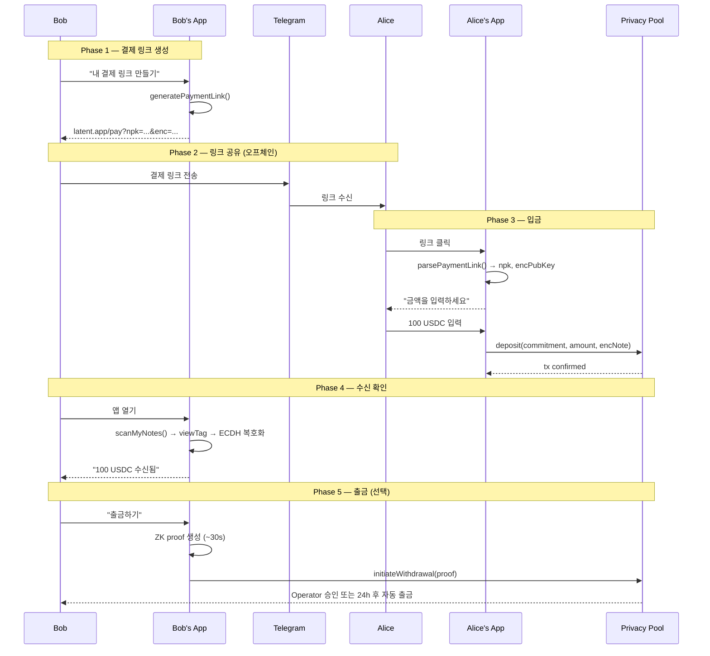

# Feature: 사용자 간 송금 흐름 (P2P Transfer Flow)

## 목적 (Why)

KYC 등록된 사용자 간 프라이버시 보호 송금의 end-to-end UX 흐름을 정의한다.
현재 SDK에 `deposit()`/`withdraw()`/`generatePaymentLink()` 구현은 있으나,
사용자 관점의 통합된 송금 경험(결제 링크 생성 → 공유 → 입금 → 수신 확인 → 출금)이 정의되어 있지 않다.

## 결정사항 (What)

- Alice가 Bob에게 송금하려면 Bob의 **npk** + **encPubKey** 두 값만 필요
- Bob은 **결제 링크**(URL)로 이 정보를 인코딩하여 텔레그램 등 메신저로 공유
- 결제 링크는 공개키만 포함 — 링크 노출 시에도 자산 안전
- 결제 링크는 **재사용 가능** — Bob은 동일 링크를 여러 사람에게 공유 가능
- 기존 SDK의 `generatePaymentLink()` / `parsePaymentLink()` 활용
- 온체인 관찰자는 Alice↔Bob 연결을 알 수 없음 (프라이버시 보장)

## 사전 조건 (Prerequisites)

- Alice, Bob 모두 KYC 등록 완료 (`POST /operator/register`)
- Alice는 충분한 토큰 잔액 보유 (ERC-20 approve 완료)
- Bob은 Latent 키 쌍 생성 완료 (`deriveKeys()`)

## 시나리오 (Scenarios)

### 정상 케이스: Bob이 결제 링크를 생성하여 Alice에게 공유

```
Given  Bob이 Latent 키를 보유하고 있다
When   Bob이 generatePaymentLink("https://app.latent.com/pay")를 호출한다
Then   "https://app.latent.com/pay?npk={bob_npk}&enc={bob_encPubKey}" 형식의 URL이 반환된다
And    URL에 npk과 enc 파라미터가 모두 포함된다
```

### 정상 케이스: Alice가 결제 링크로 송금

```
Given  Alice가 Bob의 결제 링크를 수신했다
When   Alice가 parsePaymentLink(url)로 Bob의 공개키를 추출한다
And    deposit({ recipientNpk: bob_npk, recipientEncPubKey: bob_encPubKey, amount: 100n })을 호출한다
Then   commitment이 poseidon2(secret, bob_npk, amount, blockNumber, depositor)로 생성된다
And    encryptedNote이 ECIES(bob_encPubKey, noteData)로 암호화된다
And    온체인 deposit 트랜잭션이 성공한다
And    txHash와 leafIndex가 반환된다
```

### 정상 케이스: Bob이 수신된 노트를 스캔

```
Given  Alice가 Bob에게 100 USDC를 입금했다
When   Bob이 scanMyNotes()를 호출한다
Then   viewTag 필터링 후 ECDH 복호화로 자신의 노트를 찾는다
And    OwnedNote에 secret, amount=100, blockNumber, depositor가 포함된다
And    commitment 검증이 통과한다
```

### 정상 케이스: Bob이 수신된 자산을 출금

```
Given  Bob이 scanMyNotes()로 OwnedNote를 보유하고 있다
When   Bob이 withdraw({ note, amount: 100n, recipientAddress: bob_address })를 호출한다
Then   ZK proof가 브라우저에서 생성된다 (~30s)
And    initiateWithdrawal(proof)이 온체인에 제출된다
And    Operator가 attestWithdrawal()로 즉시 승인하거나
       24시간 후 claimWithdrawal()로 자동 출금된다
```

### 경계값: 결제 링크 파라미터 누락

```
Given  잘못된 형식의 URL (npk 또는 enc 누락)
When   parsePaymentLink(url)을 호출한다
Then   "Invalid payment link: missing npk or enc parameter" 에러가 발생한다
```

### 경계값: 미등록 사용자의 npk로 입금

```
Given  Bob이 KYC 미등록 상태이다
When   Alice가 Bob의 npk로 deposit()을 호출한다
Then   입금 자체는 성공한다 (온체인에서 npk 등록 여부는 deposit 시 검증하지 않음)
But    Bob이 출금 시 registrationRoot 검증에서 실패한다
```

### 경계값: 금액 0 또는 잔액 초과

```
Given  Alice의 토큰 잔액이 50 USDC이다
When   amount: 0n으로 deposit()을 호출한다
Then   컨트랙트에서 revert된다

When   amount: 100n으로 deposit()을 호출한다
Then   ERC-20 transferFrom에서 revert된다
```

### 실패 케이스: 이미 사용된 nullifier로 출금 시도

```
Given  Bob이 이미 출금한 노트의 nullifier가 존재한다
When   동일 노트로 withdraw()를 재시도한다
Then   컨트랙트에서 "Nullifier already used" revert가 발생한다
```

### 실패 케이스: 잘못된 encPubKey로 암호화

```
Given  Alice가 변조된 encPubKey를 사용한다
When   deposit()이 실행된다
Then   입금 트랜잭션은 성공하지만
And    Bob은 scanMyNotes()에서 해당 노트를 복호화할 수 없다
And    자산이 사실상 소실된다 (복구 불가)
```

## UX 흐름 (End-to-End)



## 범위 밖 (Out of scope)

- 주소록/연락처 기반 수신자 자동 검색 (향후 기능)
- QR 코드 기반 결제 링크 공유
- 푸시 알림 기반 실시간 수신 알림
- 다중 토큰 지원 (현재 단일 ERC-20만)
- 부분 출금 UX (SDK에서는 가능하나 이번 흐름에서 다루지 않음)
- 모바일 딥링크 처리
